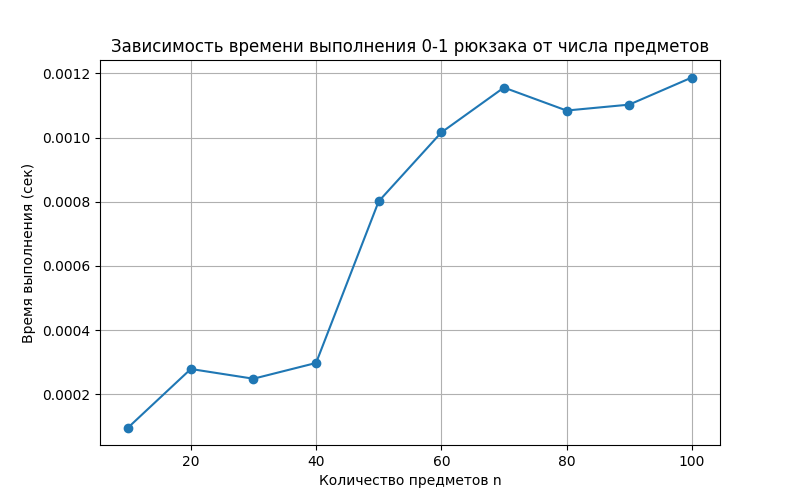

# Отчет по лабораторной работе 9
# Динамическое программирование

**Дата:** 2025-12-07
**Семестр:** 5 семестр
**Группа:** ПИЖ-б-о-23-1
**Дисциплина:** Анализ сложности программирования
**Студент:** Герасименко Константин Васильевич

## Цель работы
Изучить метод динамического программирования (ДП) как мощный инструмент для решения сложных задач путём их разбиения на перекрывающиеся подзадачи. Освоить два основных подхода к реализации ДП: нисходящий (с мемоизацией) и восходящий (с заполнением таблицы). Получить практические навыки выявления оптимальной подструктуры задач, построения таблиц ДП и
анализа временной и пространственной сложности алгоритмов
## Теоретическая часть
Динамическое программирование (ДП): Метод решения задач, в которых оптимальное решение всей задачи зависит от оптимальных решений её перекрывающихся подзадач.
Ключевые принципы:
Оптимальная подструктура: Оптимальное решение задачи может быть построено из оптимальных решений её подзадач.
Перекрывающиеся подзадачи: Подзадачи, решения которых используются многократно, а не один раз.
Подходы к реализации:
Нисходящее ДП (Top-Down, с мемоизацией): Рекурсивное решение с сохранением (кэшированием) результатов решения подзадач для повторных вычислений.
Восходящее ДП (Bottom-Up, табличное): Итеративное решение, при котором подзадачи решаются от простейших к сложным, а их результаты заносятся в таблицу (массив).
Области применения: Задачи оптимизации, подсчёта количества способов, нахождения наиболее вероятной последовательности.
Классические задачи:
Числа Фибоначчи: Классический пример перекрывающихся подзадач.
Задача о рюкзаке (0-1 Knapsack): Выбор предметов с максимальной суммарной стоимостью без дробления.
Наибольшая общая подпоследовательность (LCS): Поиск самой длинной последовательности символов, которая является подпоследовательностью двух строк.
Расстояние Левенштейна (Редакционное расстояние): Минимальное количество операций вставки, удаления и замены символа, необходимых для превращения одной строки в другую

## Практическая часть

### dynamic_programming.py
```python
from functools import lru_cache


def fibonacci(n: int) -> int:
    """
    Рекурсивное вычисление n-го числа Фибоначчи.
    Последовательность: 0, 1, 1, 2, 3, 5, 8, ...
    в глобальной переменной call_count_naive считает
    количество вызовов функции
    """
    global call_count_naive
    call_count_naive += 1
    if n <= 1:
        return n
    return fibonacci(n - 1) + fibonacci(n - 2)
    # Временная сложность: O(2^n)
    # Глубина рекурсии: O(n)


@lru_cache(maxsize=None)
def fibonacci_cached(n: int) -> int:
    """
    Рекурсивная функция для вычисления n-го числа Фибоначчи.
    Используется мемоизация через @lru_cache, чтобы избежать повторных
    вычислений
    Последовательность: 0, 1, 1, 2, 3, 5, 8, ...
    """
    if n <= 1:
        return n
    return fibonacci_cached(n - 1) + fibonacci_cached(n - 2)
    # Временная сложность: O(n)
    # Глубина рекурсии: O(n)


def fib_tabulation(n):
    if n <= 1:
        return n
    table = [0] * (n + 1)
    table[1] = 1
    for i in range(2, n + 1):
        table[i] = table[i - 1] + table[i - 2]
    return table[n]
    # Временная сложность: O(n)
    # Простронственная сложность: O(n)


def knapsack_01(values, weights, W):
    n = len(values)
    # создаём таблицу dp размером (n+1) x (W+1)
    dp = [[0 for _ in range(W + 1)] for _ in range(n + 1)]

    # заполняем таблицу
    for i in range(1, n + 1):
        for w in range(W + 1):
            if weights[i - 1] <= w:
                # Берём максимум: либо не берём предмет, либо берём его
                dp[i][w] = max(dp[i - 1][w], dp[i - 1][w - weights[i - 1]] +
                               values[i - 1])
            else:
                # Не можем взять предмет, оставляем предыдущий максимум
                dp[i][w] = dp[i - 1][w]

    return dp[n][W]  # максимальная ценность для всех предметов и веса W
    # Временная слольность: O(n * W)
    # Простронственная сложность: O(n * W)


def lcs(X, Y):
    m, n = len(X), len(Y)

    # Таблица DP
    dp = [[0] * (n + 1) for _ in range(m + 1)]

    # Заполняем DP (восходящий подход)
    for i in range(1, m + 1):
        for j in range(1, n + 1):
            if X[i - 1] == Y[j - 1]:
                dp[i][j] = dp[i - 1][j - 1] + 1
            else:
                dp[i][j] = max(dp[i - 1][j], dp[i][j - 1])

    # Восстановление LCS
    i, j = m, n
    lcs_seq = []

    while i > 0 and j > 0:
        if X[i - 1] == Y[j - 1]:
            # Символ входит в LCS
            lcs_seq.append(X[i - 1])
            i -= 1
            j -= 1
        else:
            # Идём туда, где значение dp больше
            if dp[i - 1][j] >= dp[i][j - 1]:
                i -= 1
            else:
                j -= 1

    lcs_seq.reverse()
    return dp[m][n], "".join(lcs_seq)
    # Временная слольность: O(m * n)
    # Простронственная сложность: O(m * n)


def levenshtein_distance(X, Y):
    m = len(X)
    n = len(Y)

    # создаём таблицу dp размером (m+1) x (n+1)
    dp = [[0 for _ in range(n + 1)] for _ in range(m + 1)]

    # инициализация: расстояние от пустой строки
    for i in range(m + 1):
        dp[i][0] = i  # нужно i удалений
    for j in range(n + 1):
        dp[0][j] = j  # нужно j вставок

    # заполняем таблицу
    for i in range(1, m + 1):
        for j in range(1, n + 1):
            if X[i - 1] == Y[j - 1]:
                dp[i][j] = dp[i - 1][j - 1]  # символы совпадают
            else:
                dp[i][j] = 1 + min(
                    dp[i - 1][j],    # удаление
                    dp[i][j - 1],    # вставка
                    dp[i - 1][j - 1]  # замена
                )

    return dp[m][n]
    # Временная слольность: O(m * n)
    # Простронственная сложность: O(m * n)


if __name__ == '__main__':
    print(fib_tabulation(30))
    values = [60, 100, 120]
    weights = [10, 20, 30]
    W = 50
    print(knapsack_01(values, weights, W))
    X = "AGGTAB"
    Y = "GXTXAYB"
    print(lcs(X, Y))
    X = "kitten"
    Y = "sitting"
    print(levenshtein_distance(X, Y))
```
В этом коде реализованы несколько алгоритмов динамического программирования для различных задач. Сначала определены функции для вычисления чисел Фибоначчи: рекурсивно с мемоизацией и через табличный метод, что позволяет сравнивать эффективность этих подходов. Далее реализован алгоритм решения задачи 0-1 рюкзака, который строит двумерную таблицу, учитывая значения и веса предметов, чтобы найти максимальную суммарную ценность. Затем приведена функция для нахождения наибольшей общей подпоследовательности двух строк, которая заполняет таблицу DP и восстанавливает саму последовательность. Также есть функция для вычисления расстояния Левенштейна между двумя строками, определяющая минимальное количество операций вставки, удаления и замены для преобразования одной строки в другую. В блоке `__main__` демонстрируется применение всех этих алгоритмов на конкретных примерах с выводом результатов на экран. Код сопровождается комментариями о временной и пространственной сложности каждого алгоритма.

### comparsion.py

```python
import time
import random
import tracemalloc

from dynamic_programming import fibonacci_cached, fib_tabulation, knapsack_01


def benchmark(func, n):
    print(f"\nТест: {func.__name__}, n={n}")
    tracemalloc.start()
    start = time.perf_counter()
    result = func(n)
    end = time.perf_counter()
    current, peak = tracemalloc.get_traced_memory()
    tracemalloc.stop()

    print(f"Результат: {result}")
    print(f"Время: {end - start:.6f} сек")
    print(f"Память (пик): {peak / 1024:.2f} KB")


def benchmark_knapsack():
    ns = [10, 50, 100, 200]       # количество предметов
    Ws = [50, 100, 200, 500]      # вместимость рюкзака

    print("Исследование масштабируемости алгоритма 0-1 рюкзака")
    print("{:<10} {:<10} {:<15}".format("n", "W", "Время (сек)"))

    for n in ns:
        for W in Ws:
            # случайные значения и веса
            values = [random.randint(1, 100) for _ in range(n)]
            weights = [random.randint(1, W//2) for _ in range(n)]

            start = time.perf_counter()
            knapsack_01(values, weights, W)
            end = time.perf_counter()

            print("{:<10} {:<10} {:<15.6f}".format(n, W, end - start))


if __name__ == "__main__":
    N = 35

    benchmark(fibonacci_cached, N)
    benchmark(fib_tabulation, N)
    benchmark_knapsack()
```
В этом коде проводится измерение производительности и потребления памяти для алгоритмов динамического программирования. Функция `benchmark` замеряет время выполнения и пик используемой памяти для вычисления числа Фибоначчи с помощью рекурсии с мемоизацией и табличного метода, выводя результат, время работы и память в килобайтах. Функция `benchmark_knapsack` исследует масштабируемость алгоритма 0-1 рюкзака при различных количествах предметов и вместимостях рюкзака, создавая случайные значения и веса, затем замеряя время выполнения и выводя таблицу с результатами. В блоке `__main__` сначала выполняются тесты для чисел Фибоначчи, затем проводится эксперимент по масштабируемости рюкзака, что позволяет наглядно оценить влияние увеличения размера входных данных на скорость работы алгоритмов и использование памяти.

### tasks.py

```python
def coin_change(coins, amount):
    # "бесконечное" значение для инициализации
    INF = float('inf')

    # dp[x] = минимальное количество монет для суммы x
    dp = [INF] * (amount + 1)
    dp[0] = 0

    # строим dp снизу вверх
    for coin in coins:
        for x in range(coin, amount + 1):
            dp[x] = min(dp[x], dp[x - coin] + 1)

    # если сумма не достижима
    return dp[amount] if dp[amount] != INF else -1


def lis(nums):
    n = len(nums)

    if n == 0:
        return 0, []

    # dp[i] = длина LIS, заканчивающейся на nums[i]
    dp = [1] * n

    # prev[i] = индекс предыдущего элемента в LIS
    prev = [-1] * n

    # Заполнение DP (восходящий подход)
    for i in range(1, n):
        for j in range(0, i):
            if nums[j] < nums[i] and dp[j] + 1 > dp[i]:
                dp[i] = dp[j] + 1
                prev[i] = j

    # Длина LIS — максимум в dp[]
    lis_length = max(dp)

    # Находим последний элемент LIS
    end_index = dp.index(lis_length)

    # Восстановление LIS
    lis_seq = []
    while end_index != -1:
        lis_seq.append(nums[end_index])
        end_index = prev[end_index]

    lis_seq.reverse()

    return lis_length, lis_seq

    # Временная сложность: O(n^2)
    # Пространственная сложность: O(n)


if __name__ == "__main__":
    print("=== Демонстрация coin_change ===")
    coins = [1, 3, 4]
    amount = 6
    result = coin_change(coins, amount)
    print(f"Монеты: {coins}")
    print(f"Сумма: {amount}")
    print(f"Минимальное количество монет: {result}")

    print("\n=== Демонстрация LIS ===")
    arr = [10, 9, 2, 5, 3, 7, 101, 18]
    length, sequence = lis(arr)
    print(f"Массив: {arr}")
    print(f"Длина LIS: {length}")
    print(f"LIS: {sequence}")
```
В этом коде реализованы два алгоритма динамического программирования и демонстрируется их работа на конкретных примерах. Функция `coin_change` вычисляет минимальное количество монет, необходимое для заданной суммы, создавая массив `dp`, в котором для каждой промежуточной суммы хранится минимальное число монет, и обновляет его для каждой доступной монеты. Если сумму невозможно составить, функция возвращает -1. Функция `lis` находит наибольшую возрастающую подпоследовательность в массиве чисел, используя массив `dp` для хранения длины подпоследовательности, заканчивающейся на каждом элементе, и массив `prev` для восстановления самой подпоследовательности. В блоке `__main__` демонстрируется работа обоих алгоритмов на конкретных данных, выводя исходные массивы, минимальное количество монет для размена и длину вместе с самой наибольшей возрастающей подпоследовательностью. Код содержит комментарии о временной и пространственной сложности алгоритма LIS.

### visualization.py

```python
import time
import random

import matplotlib.pyplot as plt

from dynamic_programming import knapsack_01


def benchmark_knapsack(max_n=100, W=50, step=10):
    ns = list(range(step, max_n + 1, step))
    times = []

    for n in ns:
        values = [random.randint(1, 100) for _ in range(n)]
        weights = [random.randint(1, W//2) for _ in range(n)]

        start = time.perf_counter()
        knapsack_01(values, weights, W)
        end = time.perf_counter()

        times.append(end - start)

    return ns, times


def knapsack_01_visual(values, weights, W):
    n = len(values)
    dp = [[0] * (W + 1) for _ in range(n + 1)]

    print("Начальная таблица DP:")
    for row in dp:
        print(row)
    print("\nЗаполнение таблицы DP:")

    for i in range(1, n + 1):
        for w in range(W + 1):
            if weights[i - 1] <= w:
                dp[i][w] = max(dp[i - 1][w], dp[i - 1][w - weights[i - 1]] + values[i - 1])
            else:
                dp[i][w] = dp[i - 1][w]

        print(f"\nПосле обработки предмета {i} (value={values[i-1]}, weight={weights[i-1]}):")
        for row in dp:
            print(row)

    selected = []
    w = W
    for i in range(n, 0, -1):
        if dp[i][w] != dp[i-1][w]:
            selected.append(i-1)
            w -= weights[i-1]
    selected.reverse()

    print(f"\nМаксимальная ценность: {dp[n][W]}")
    print(f"Выбранные предметы: {selected}")
    return dp[n][W], selected


if __name__ == "__main__":
    # Демонстрация визуализации DP для маленьких данных
    values = [60, 100, 120]
    weights = [10, 20, 30]
    W = 50
    knapsack_01_visual(values, weights, W)

    ns, times = benchmark_knapsack(max_n=100, W=50, step=10)

    plt.figure(figsize=(8, 5))
    plt.plot(ns, times, marker='o')
    plt.title("Зависимость времени выполнения 0-1 рюкзака от числа предметов")
    plt.xlabel("Количество предметов n")
    plt.ylabel("Время выполнения (сек)")
    plt.grid(True)
    plt.show()
```
В этом коде реализуется анализ работы алгоритма 0-1 рюкзака и визуализация процесса динамического программирования. Функция `knapsack_01_visual` демонстрирует заполнение таблицы DP для небольшого набора предметов, выводя её состояние после добавления каждого предмета и восстанавливая список выбранных предметов, а также максимальную суммарную ценность рюкзака. Функция `benchmark_knapsack` измеряет время выполнения алгоритма для различных количеств предметов, создавая случайные значения и веса и записывая время работы для каждой конфигурации. В блоке `__main__` сначала выполняется визуализация таблицы DP на небольших данных, после чего проводится замер времени для увеличивающихся размеров задачи, а результаты отображаются на графике зависимости времени выполнения от количества предметов с помощью библиотеки matplotlib.

### Анализ результатов

Разные подходы динамического программирования имеют заметные различия по времени и памяти. Рекурсивный метод без мемоизации демонстрирует экспоненциальный рост времени и быстро становится непрактичным даже для небольших входных данных. Рекурсия с мемоизацией и табличный (восходящий) подход сокращают количество повторных вычислений, обеспечивая линейное или квадратичное время в зависимости от задачи, при этом использование памяти увеличивается пропорционально размеру таблицы. Увеличение числа элементов или вместимости, как в задаче о рюкзаке, напрямую повышает время выполнения и объём памяти, тогда как для числовых последовательностей рост входных параметров ведёт к увеличению размера DP-таблиц и глубины рекурсии. Таким образом, эффективность и ресурсоёмкость алгоритма зависят от выбранного подхода и масштабов задачи, что необходимо учитывать при разработке и оптимизации.

## Контрольные вопросы

1. Какие два основных свойства задачи указывают на то, что для ее решения можно применить динамическое программирование? - Для применения динамического программирования задача должна обладать оптимальной подструктурой, когда решение всей задачи может быть построено из решений её подзадач, и перекрывающимися подзадачами, когда одни и те же подзадачи встречаются несколько раз и их результаты можно хранить для повторного использования.
2. В чем разница между нисходящим (top-down) и восходящим (bottom-up) подходами в динамическом программировании? - В нисходящем подходе (top-down) задача решается рекурсивно, начиная с основной цели и разбивая её на подзадачи с сохранением результатов для повторного использования, тогда как в восходящем подходе (bottom-up) решения подзадач строятся последовательно с самого простого случая к более сложным, заполняя таблицу DP без рекурсии.
3. Как задача о рюкзаке 0-1 демонстрирует свойство оптимальной подструктуры? - Задача о рюкзаке 0-1 демонстрирует оптимальную подструктуру тем, что максимальная ценность для заданного числа предметов и веса рюкзака может быть получена как максимум между решением для того же веса без последнего предмета и суммой ценности последнего предмета с решением для оставшегося веса без него, то есть решение всей задачи строится из решений её подзадач.
4. Опишите, как строится и заполняется таблица для решения задачи о наибольшей общей подпоследовательности (LCS) - Для решения задачи LCS создаётся таблица размером (m+1)×(n+1), где m и n — длины строк. Строки и столбцы инициализируются нулями, а затем заполняются построчно: если символы в текущих позициях совпадают, значение берётся из диагонального элемента плюс один, иначе выбирается максимум из верхнего или левого соседнего элемента. После заполнения таблицы длина LCS находится в правом нижнем углу, а сама последовательность восстанавливается, двигаясь по таблице от конца к началу, выбирая соответствующие совпадения.
5. Как с помощью динамического программирования можно уменьшить сложность вычисления чисел Фибоначчи с экспоненциальной до линейной или даже до O(log n)? - С помощью динамического программирования вычисление чисел Фибоначчи ускоряется за счёт хранения уже найденных значений: рекурсия с мемоизацией или табличный подход позволяют вычислять каждое число один раз, снижая сложность до линейной, а использование матричного возведения в степень или формулы быстрого удвоения позволяет получить число Фибоначчи за O(log n).


