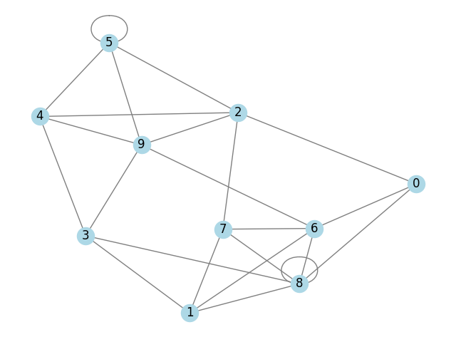
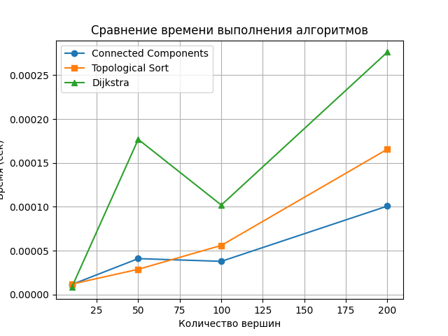

# Отчет по лабораторной работе 10
# Графы

**Дата:** 2025-10-12
**Семестр:** 5
**Группа:** ПИЖ-б-о-23-1
**Дисциплина:** Анализ сложности алгоритмов
**Студент:** Герасименко Константин Васильевич

## Цель работы
Изучить основные понятия теории графов и алгоритмы работы с ними. Освоить представления графов в памяти и основные алгоритмы обхода. Получить практические навыки реализации алгоритмов на графах и анализа их сложности.

## Теоретическая часть
Граф: Множество вершин (узлов) и рёбер (связей) между ними. Виды: ориентированные/неориентированные, взвешенные/невзвешенные.
Представление графов:
Матрица смежности: O(V²) памяти, быстрая проверка ребра
Список смежности: O(V + E) памяти, эффективный обход соседей
Обход графов:
Поиск в ширину (BFS): находит кратчайшие пути в невзвешенном графе, сложность O(V + E)
Поиск в глубину (DFS): обход с возвратом, сложность O(V + E)
Алгоритмы на графах:
Топологическая сортировка: для ориентированных ациклических графов (DAG)
Поиск компонент связности
Алгоритм Дейкстры: кратчайшие пути во взвешенном графе с неотрицательными весами

## Практическая часть
### graph_representation.py
```python
from collections import deque


class AdjacencyMatrixGraph:
    def __init__(self):
        # Матрица хранится как список списков
        # Память: O(V^2), где V — число вершин
        self.matrix = []

    def add_vertex(self):
        """
        Добавление вершины.
        Сложность: O(V), потому что нужно добавить 1 столбец в каждую строку.
        """
        V = len(self.matrix)
        for row in self.matrix:
            row.append(0)  # расширяем каждую строку
        self.matrix.append([0] * (V + 1))  # добавляем новую строку нулей

    def remove_vertex(self, v):
        """
        Удаление вершины по индексу v.
        Сложность: O(V^2), так как нужно удалить строку и столбец.
        """
        self.matrix.pop(v)
        for row in self.matrix:
            row.pop(v)

    def add_edge(self, u, v):
        """
        Добавление ребра (u, v).
        Сложность: O(1).
        """
        self.matrix[u][v] = 1
        self.matrix[v][u] = 1  # если граф неориентированный

    def remove_edge(self, u, v):
        """
        Удаление ребра (u, v).
        Сложность: O(1).
        """
        self.matrix[u][v] = 0
        self.matrix[v][u] = 0  # если граф неориентированный


class AdjacencyListGraph:
    def __init__(self):
        # Список: у каждой вершины свой список соседей
        # Память: O(V + E), где E — число рёбер
        self.adj = []

    def add_vertex(self):
        """
        Добавление вершины.
        Сложность: O(1).
        """
        self.adj.append([])

    def remove_vertex(self, v):
        """
        Удаление вершины v.
        Сложность: O(V + E).
        """
        self.adj.pop(v)
        for neighbors in self.adj:
            # удаление: O(deg), в сумме O(E)
            while v in neighbors:
                neighbors.remove(v)
            # уменьшение индексов вершин > v
            for i in range(len(neighbors)):
                if neighbors[i] > v:
                    neighbors[i] -= 1

    def add_edge(self, u, v):
        """
        Добавление ребра (u, v).
        Сложность: O(1) амортизированно.
        """
        self.adj[u].append(v)
        self.adj[v].append(u)  # если граф неориентированный

    def remove_edge(self, u, v):
        """
        Удаление ребра (u, v).
        Сложность: O(deg(u) + deg(v)).
        """
        if v in self.adj[u]:
            self.adj[u].remove(v)
        if u in self.adj[v]:
            self.adj[v].remove(u)


# ---------------- BFS ---------------- #

def bfs_with_paths(adj, start):
    """
    BFS с расстояниями и родителями для восстановления пути.
    Время:  O(V + E)
    Память: O(V)
    """

    n = len(adj)
    dist = [-1] * n
    parent = [-1] * n

    dist[start] = 0
    queue = deque([start])

    while queue:
        v = queue.popleft()

        for to in adj[v]:
            if dist[to] == -1:      # ещё не посещён
                dist[to] = dist[v] + 1
                parent[to] = v
                queue.append(to)

    return dist, parent


def restore_path(parent, target):
    """
    Восстановление пути по массиву parent.
    Время: O(L), где L — длина пути.
    """
    path = []
    v = target
    while v != -1:
        path.append(v)
        v = parent[v]
    return path[::-1]


# DFS (recursive)

def dfs_recursive(adj, start, visited=None):
    """
    Рекурсивный DFS.
    Время:  O(V + E)
    Память: O(V) из-за глубины рекурсии
    """

    if visited is None:
        visited = [False] * len(adj)

    visited[start] = True

    for to in adj[start]:
        if not visited[to]:
            dfs_recursive(adj, to, visited)

    return visited


# DFS (iterative)

def dfs_iterative(adj, start):
    """
    Итеративный DFS на стеке.
    Время:  O(V + E)
    Память: O(V)
    """

    visited = [False] * len(adj)
    stack = [start]

    while stack:
        v = stack.pop()

        if not visited[v]:
            visited[v] = True

            for to in reversed(adj[v]):
                if not visited[to]:
                    stack.append(to)

    return visited


def main():
    # создаём граф
    g = AdjacencyListGraph()

    # добавим 5 вершин
    for _ in range(5):
        g.add_vertex()

    # добавим рёбра
    g.add_edge(0, 1)
    g.add_edge(0, 2)
    g.add_edge(1, 3)
    g.add_edge(2, 3)
    g.add_edge(3, 4)

    print("Список смежности:", g.adj)

    # BFS
    dist, parent = bfs_with_paths(g.adj, 0)
    print("\nBFS расстояния:", dist)
    print("BFS родители:", parent)

    # восстановление пути 0 → 4
    path = restore_path(parent, 4)
    print("Путь 0 → 4:", path)

    # ---- DFS recursive ----
    visited_rec = dfs_recursive(g.adj, 0)
    print("\nDFS (рекурсивный):", visited_rec)

    # ---- DFS iterative ----
    visited_it = dfs_iterative(g.adj, 0)
    print("DFS (итеративный):", visited_it)


# Запуск
if __name__ == "__main__":
    main()
```
В этом файле реализованы основные способы представления графов и базовые алгоритмы обхода графа. Сначала определены два класса графов: граф на основе матрицы смежности и граф на основе списка смежности. Матрица смежности хранит информацию о рёбрах в виде двумерного массива, что удобно для быстрого доступа к наличию ребра, но требует много памяти. Список смежности хранит для каждой вершины список её соседей и является более эффективным по памяти для разреженных графов.

Далее реализован алгоритм BFS (поиск в ширину), который обходит граф уровнями, начиная с заданной вершины. В процессе работы он вычисляет расстояние от стартовой вершины до всех остальных и сохраняет родителей вершин, что позволяет восстановить кратчайший путь. Для восстановления пути используется отдельная функция, которая проходит по массиву родителей от целевой вершины к стартовой.

Также в файле реализованы два варианта DFS (поиска в глубину). Рекурсивный вариант использует стек вызовов и последовательно углубляется в граф, пока это возможно. Итеративный вариант делает то же самое, но явно использует стек, что позволяет избежать переполнения стека вызовов при больших графах. Оба варианта отмечают посещённые вершины и гарантируют, что каждая вершина будет обработана не более одного раза.

В функции main показан пример использования всех реализованных структур и алгоритмов. Создаётся граф со списком смежности, добавляются вершины и рёбра, после чего выполняются BFS и DFS. Результаты работы алгоритмов выводятся на экран: список смежности графа, расстояния и путь, найденные с помощью BFS, а также массивы посещённых вершин для обоих вариантов DFS. Этот пример демонстрирует корректность работы реализованных алгоритмов и их применение на простом графе.

### graph_traverasl.py
```python
import time
import random
import matplotlib.pyplot as plt
import networkx as nx
from graph_representation import AdjacencyListGraph
from heapq import heappush, heappop


def connected_components(adj):
    n = len(adj)
    visited = [False] * n
    components = []

    for v in range(n):
        if not visited[v]:
            stack = [v]
            comp = []
            visited[v] = True

            while stack:
                u = stack.pop()
                comp.append(u)
                for to in adj[u]:
                    if not visited[to]:
                        visited[to] = True
                        stack.append(to)
            components.append(comp)
    return components


def topological_sort(adj):
    n = len(adj)
    indeg = [0] * n
    for v in adj:
        for to in v:
            indeg[to] += 1
    queue = [v for v in range(n) if indeg[v] == 0]
    order = []
    while queue:
        v = queue.pop()
        order.append(v)
        for to in adj[v]:
            indeg[to] -= 1
            if indeg[to] == 0:
                queue.append(to)
    if len(order) != n:
        raise ValueError("Граф содержит цикл")
    return order


def dijkstra(adj_w, start):
    INF = 10**18
    n = len(adj_w)
    dist = [INF] * n
    parent = [-1] * n
    dist[start] = 0
    pq = []
    heappush(pq, (0, start))
    while pq:
        d, v = heappop(pq)
        if d != dist[v]:
            continue
        for to, w in adj_w[v]:
            if dist[v] + w < dist[to]:
                dist[to] = dist[v] + w
                parent[to] = v
                heappush(pq, (dist[to], to))
    return dist, parent


# Измерение времени
def measure_time(func, *args):
    start = time.time()
    func(*args)
    end = time.time()
    return end - start


def generate_random_graph(n, edge_factor=3, weighted=False):
    g = AdjacencyListGraph()
    for _ in range(n):
        g.add_vertex()
    edges = []
    for _ in range(n * edge_factor):
        u, v = random.randint(0, n-1), random.randint(0, n-1)
        g.add_edge(u, v)
        w = random.randint(1, 10)
        if weighted:
            edges.append((u, v, w))
    if weighted:
        adj_w = [[] for _ in range(n)]
        for u, v, w in edges:
            adj_w[u].append((v, w))
        return g, adj_w
    return g, None


# Визуализация графа
def draw_graph(adj, title="Graph"):
    G = nx.Graph()
    for i, neighbors in enumerate(adj):
        for j in neighbors:
            G.add_edge(i, j)
    nx.draw(G, with_labels=True, node_color='lightblue', edge_color='gray')
    plt.title(title)
    plt.show()


def main():
    sizes = [10, 50, 100, 200]  # размер графа
    times_cc = []
    times_ts = []
    times_dj = []

    for n in sizes:
        print(f"\nГраф с {n} вершинами:")
        g, adj_w = generate_random_graph(n, edge_factor=3, weighted=True)

        t_cc = measure_time(connected_components, g.adj)
        times_cc.append(t_cc)
        print(f"connected_components: {t_cc:.6f} с")

        # топологическая сортировка (на небольшом DAG)
        dag = [list(range(i+1, min(i+4, n))) for i in range(n)]
        t_ts = measure_time(topological_sort, dag)
        times_ts.append(t_ts)
        print(f"topological_sort: {t_ts:.6f} с")

        t_dj = measure_time(dijkstra, adj_w, 0)
        times_dj.append(t_dj)
        print(f"Dijkstra: {t_dj:.6f} с")

        # Визуализируем небольшой граф
        if n <= 20:
            draw_graph(g.adj, title=f"Random Graph n={n}")

    # Графики
    plt.plot(sizes, times_cc, 'o-', label='Connected Components')
    plt.plot(sizes, times_ts, 's-', label='Topological Sort')
    plt.plot(sizes, times_dj, '^-', label='Dijkstra')
    plt.xlabel('Количество вершин')
    plt.ylabel('Время (сек)')
    plt.title('Сравнение времени выполнения алгоритмов')
    plt.legend()
    plt.grid(True)
    plt.show()


if __name__ == "__main__":
    main()
```
Этот файл предназначен для экспериментального исследования производительности алгоритмов на графах и их визуализации. В начале подключаются библиотеки для измерения времени, генерации случайных данных и построения графиков, а также используется реализация графа на списке смежности из предыдущего файла.

В коде реализованы три алгоритма: поиск компонент связности, топологическая сортировка и алгоритм Дейкстры. Поиск компонент связности обходит граф в глубину и группирует вершины по связным подграфам. Топологическая сортировка применяется к ориентированному ациклическому графу и строит линейный порядок вершин с учётом направлений рёбер, при наличии цикла выбрасывается ошибка. Алгоритм Дейкстры находит кратчайшие пути от стартовой вершины во взвешенном графе, используя приоритетную очередь.

Для корректного сравнения производительности введена функция измерения времени, которая замеряет длительность выполнения любого алгоритма. Также реализована функция генерации случайных графов заданного размера, позволяющая создавать как обычные, так и взвешенные графы. Это даёт возможность проверить масштабируемость алгоритмов при увеличении числа вершин.

В основной функции последовательно рассматриваются графы разных размеров. Для каждого размера создаётся случайный граф, после чего измеряется время работы поиска компонент связности, топологической сортировки и алгоритма Дейкстры. Полученные значения сохраняются и выводятся в консоль, что позволяет наблюдать рост времени выполнения по мере увеличения размера графа.

Дополнительно реализована визуализация графов с помощью библиотеки networkx. Для небольших графов строится наглядное изображение вершин и рёбер, что упрощает понимание структуры данных. В конце работы программы строятся графики зависимости времени выполнения алгоритмов от количества вершин, что позволяет наглядно сравнить их эффективность и сделать выводы о масштабируемости каждого алгоритма.

### shortest_path.py
```python
from collections import deque
from graph_representation import AdjacencyListGraph
from graph_traversal import connected_components, topological_sort


# Кратчайший путь в лабиринте
def shortest_path_maze(maze, start, end):
    n, m = len(maze), len(maze[0])
    queue = deque([start])
    visited = [[False]*m for _ in range(n)]
    parent = [[None]*m for _ in range(n)]
    visited[start[0]][start[1]] = True

    dirs = [(0, 1), (1, 0), (0, -1), (-1, 0)]  # вправо, вниз, влево, вверх

    while queue:
        x, y = queue.popleft()
        if (x, y) == end:
            break
        for dx, dy in dirs:
            nx_, ny_ = x+dx, y+dy
            if 0 <= nx_ < n and 0 <= ny_ < m and maze[nx_][ny_] == 0 and not visited[nx_][ny_]:
                visited[nx_][ny_] = True
                parent[nx_][ny_] = (x, y)
                queue.append((nx_, ny_))

    # восстановление пути
    path = []
    cur = end
    while cur:
        path.append(cur)
        cur = parent[cur[0]][cur[1]]
    path.reverse()

    if path[0] != start:
        return []  # путь не найден
    return path


# Проверка связности сети
def is_network_connected(adj):
    comps = connected_components(adj)
    return len(comps) == 1


# Топологическая сортировка
def solve_topo(adj):
    return topological_sort(adj)


def main():
    # Пример лабиринта: 0 - свободная клетка, 1 - стена
    maze = [
        [0, 0, 1, 0],
        [1, 0, 1, 0],
        [0, 0, 0, 0],
        [0, 1, 1, 0]
    ]
    start, end = (0, 0), (3, 3)
    path = shortest_path_maze(maze, start, end)
    print("Кратчайший путь в лабиринте:", path)

    # Пример сети
    g = AdjacencyListGraph()
    for _ in range(5):
        g.add_vertex()
    g.add_edge(0, 1)
    g.add_edge(1, 2)
    g.add_edge(2, 3)
    g.add_edge(3, 4)
    print("Сеть связна?", is_network_connected(g.adj))

    # Пример DAG для топологической сортировки
    dag = [
        [1, 2],
        [3],
        [3],
        []
    ]
    print("Топологическая сортировка:", solve_topo(dag))


if __name__ == "__main__":
    main()
```
В этом файле показано практическое применение графовых алгоритмов для решения прикладных задач. В начале подключаются необходимые модули: очередь для реализации поиска в ширину, класс графа со списком смежности и алгоритмы обхода и анализа графов, реализованные ранее. Это подчёркивает модульную структуру проекта и повторное использование кода.

Функция поиска кратчайшего пути в лабиринте реализует алгоритм BFS на двумерной сетке. Лабиринт рассматривается как граф, в котором каждая свободная клетка является вершиной, а возможные переходы между соседними клетками — рёбрами. Алгоритм последовательно обходит клетки, начиная со стартовой, и запоминает родительские клетки, что позволяет восстановить кратчайший путь до целевой позиции. Если путь отсутствует, функция корректно сообщает об этом, возвращая пустой список.

Далее реализована проверка связности сети. Сеть представляется в виде графа со списком смежности, а связность определяется с помощью алгоритма поиска компонент связности. Если весь граф состоит из одной компоненты, сеть считается связной, иначе делается вывод о наличии разрывов в соединениях.

Также в файле показано решение задачи топологической сортировки. Для ориентированного ациклического графа вычисляется линейный порядок вершин, удовлетворяющий направлению рёбер. Это типичная задача для моделирования зависимостей, например, порядка выполнения работ или сборки модулей.

В функции main приведены наглядные примеры использования всех реализованных функций. Демонстрируется поиск пути в лабиринте, проверка связности простой сети и выполнение топологической сортировки для ориентированного графа без циклов. Этот файл завершает проект, показывая, как базовые алгоритмы теории графов применяются к реальным задачам и как они взаимодействуют между собой в рамках единой программной системы.

### unit.py
```python
import unittest

from graph_representation import (
    AdjacencyListGraph,
    bfs_with_paths,
    dfs_recursive,
    dfs_iterative,
    restore_path,
)


from graph_traversal import (
    connected_components,
    topological_sort,
    dijkstra,
)


class TestGraphAlgorithms(unittest.TestCase):

    # ---------------- BFS ---------------- #
    def test_bfs_basic(self):
        g = AdjacencyListGraph()
        for _ in range(5):
            g.add_vertex()

        edges = [(0, 1), (0, 2), (1, 3), (2, 3), (3, 4)]
        for u, v in edges:
            g.add_edge(u, v)

        dist, parent = bfs_with_paths(g.adj, 0)

        self.assertEqual(dist, [0, 1, 1, 2, 3])
        self.assertEqual(restore_path(parent, 4), [0, 1, 3, 4])

    # ---------------- DFS ---------------- #
    def test_dfs_recursive(self):
        g = AdjacencyListGraph()
        for _ in range(4):
            g.add_vertex()

        g.add_edge(0, 1)
        g.add_edge(1, 2)
        g.add_edge(2, 3)

        visited = dfs_recursive(g.adj, 0)
        self.assertEqual(visited, [True, True, True, True])

    def test_dfs_iterative(self):
        g = AdjacencyListGraph()
        for _ in range(4):
            g.add_vertex()

        g.add_edge(0, 1)
        g.add_edge(1, 2)
        g.add_edge(2, 3)

        visited = dfs_iterative(g.adj, 0)
        self.assertEqual(visited, [True, True, True, True])

    # ---------------- Connected Components ---------------- #
    def test_connected_components(self):
        g = AdjacencyListGraph()
        for _ in range(6):
            g.add_vertex()

        edges = [(0, 1), (1, 2), (3, 4)]
        for u, v in edges:
            g.add_edge(u, v)

        comps = connected_components(g.adj)
        comps = [sorted(c) for c in comps]
        comps.sort()

        expected = [[0, 1, 2], [3, 4], [5]]
        self.assertEqual(comps, expected)

    # ---------------- Topological Sort ---------------- #
    def test_topological_sort(self):
        dag = [
            [1, 2],
            [3],
            [3],
            []
        ]

        order = topological_sort(dag)
        self.assertTrue(order.index(0) < order.index(1))
        self.assertTrue(order.index(0) < order.index(2))
        self.assertTrue(order.index(1) < order.index(3))
        self.assertTrue(order.index(2) < order.index(3))

    def test_topological_sort_cycle(self):
        cyclic = [
            [1],
            [2],
            [0],  # цикл
        ]
        with self.assertRaises(ValueError):
            topological_sort(cyclic)

    # ---------------- Dijkstra ---------------- #
    def test_dijkstra(self):
        adj_w = [
            [(1, 4), (2, 1)],
            [(3, 1)],
            [(1, 2), (3, 5)],
            []
        ]

        dist, parent = dijkstra(adj_w, 0)
        self.assertEqual(dist, [0, 3, 1, 4])  # корректнейшие дистанции
        self.assertEqual(parent[3], 1)


if __name__ == "__main__":
    unittest.main()
```
В этом файле реализованы модульные тесты, проверяющие корректность работы всех основных алгоритмов, использованных в проекте. Для тестирования применяется стандартный модуль unittest, который позволяет автоматически запускать проверки и выявлять ошибки в логике алгоритмов.

В начале подключаются классы и функции из ранее написанных файлов. Это включает представление графа в виде списка смежности, алгоритмы обхода графа в ширину и глубину, восстановление пути, а также более сложные алгоритмы анализа графов, такие как поиск компонент связности, топологическая сортировка и алгоритм Дейкстры. Таким образом тесты охватывают как базовые, так и продвинутые части проекта.

Тесты для BFS проверяют корректность вычисления расстояний от стартовой вершины и правильность восстановления кратчайшего пути до заданной вершины. Это важно, так как BFS часто используется для поиска кратчайших путей в невзвешенных графах.

Тесты для DFS реализованы в двух вариантах — рекурсивном и итеративном. В обоих случаях проверяется, что обход действительно посещает все достижимые вершины, что подтверждает корректность логики обхода независимо от способа реализации.

Далее тестируется алгоритм поиска компонент связности. Для графа с несколькими изолированными частями проверяется, что алгоритм правильно разбивает вершины на компоненты, включая одиночные вершины без рёбер.

Топологическая сортировка проверяется в двух сценариях. В первом случае используется корректный ориентированный ациклический граф, и тесты убеждаются, что порядок вершин удовлетворяет всем зависимостям. Во втором случае используется граф с циклом, и проверяется, что алгоритм корректно обнаруживает ошибку и выбрасывает исключение.

Завершающая часть посвящена алгоритму Дейкстры. Тест подтверждает правильность вычисления кратчайших расстояний во взвешенном графе и корректность построения дерева кратчайших путей через массив родителей.

### Анализ результатов

 
В ходе работы была проведена сравнительная оценка эффективности различных представлений графов, а также проанализирована применимость реализованных алгоритмов для решения задач разных типов. Рассматривались два основных способа хранения графа: матрица смежности и список смежности.

Матрица смежности проста в реализации и удобна для проверки наличия ребра между двумя вершинами, так как такая операция выполняется за константное время. Однако она требует квадратичного объёма памяти, что делает её неэффективной для разреженных графов с большим числом вершин. Добавление и удаление вершин также является затратной операцией, поскольку требует перераспределения всей матрицы. Поэтому данное представление оправдано в задачах с небольшими графами или в случае, когда граф плотный и количество рёбер близко к максимальному.

Список смежности, напротив, использует память более экономно и масштабируется значительно лучше, так как объём памяти зависит от числа вершин и рёбер. Это представление особенно эффективно для разреженных графов, которые чаще всего встречаются на практике. Большинство алгоритмов обхода и анализа графов, таких как BFS, DFS, поиск компонент связности и алгоритм Дейкстры, работают со списком смежности быстрее и проще в реализации. Недостатком является более дорогая проверка существования конкретного ребра, но в большинстве практических задач это не критично.

Анализ применимости алгоритмов показал, что выбор алгоритма напрямую зависит от типа задачи и свойств графа. BFS наиболее эффективен для поиска кратчайших путей в невзвешенных графах, например при навигации по лабиринтам или сетям. DFS удобен для анализа структуры графа, поиска компонент связности и проверки достижимости, а также часто используется как основа для других алгоритмов. Топологическая сортировка применима только к ориентированным ациклическим графам и используется в задачах планирования, управления зависимостями и построения порядка выполнения операций. Алгоритм Дейкстры предназначен для поиска кратчайших путей во взвешенных графах с неотрицательными весами и широко применяется в задачах маршрутизации и моделирования сетей.

Таким образом, результаты работы показывают, что список смежности является наиболее универсальным и эффективным представлением графа для большинства практических задач, а корректный выбор алгоритма и структуры данных позволяет существенно повысить производительность и масштабируемость решений при работе с графами.

## Ответы на контрольные вопросы
1.  В чем разница между представлением графа в виде матрицы смежности и списка смежности? Сравните их по потреблению памяти и сложности операций. - Матрица смежности и список смежности отличаются способом хранения рёбер графа и, как следствие, требованиями к памяти и скоростью выполнения операций. Матрица смежности хранит граф в виде двумерного массива размера V×V, где V — число вершин, поэтому она всегда требует O(V²) памяти независимо от количества рёбер. Проверка наличия ребра между двумя вершинами в этом представлении выполняется за O(1), однако добавление или удаление вершины обходится дорого, так как требует изменения всей матрицы. Такое представление удобно для плотных и небольших графов.
Список смежности хранит для каждой вершины список её соседей и требует O(V + E) памяти, где E — число рёбер, поэтому он значительно экономичнее для разреженных графов. Добавление вершины и рёбер выполняется быстрее, а обходы графа, такие как BFS и DFS, работают более эффективно. Проверка существования конкретного ребра занимает больше времени, так как требуется просмотр списка соседей. В целом список смежности лучше подходит для больших графов и большинства практических задач.

2. Опишите алгоритм поиска в ширину (BFS). Для решения каких задач он применяется? - Поиск в ширину (BFS) — это алгоритм обхода графа, который начинает работу с выбранной вершины и последовательно посещает все вершины на расстоянии один, затем на расстоянии два и так далее. Алгоритм использует очередь, что позволяет обрабатывать вершины в порядке их удалённости от стартовой. BFS помечает посещённые вершины, чтобы избежать повторных обходов, и может хранить расстояния и родителей для восстановления путей.

BFS применяется для поиска кратчайших путей в невзвешенных графах, проверки связности графа, нахождения компонент связности, поиска пути в лабиринтах, а также для решения задач, где важен минимальный по количеству рёбер путь между вершинами.

3. Чем поиск в глубину (DFS) отличается от BFS? Какие дополнительные задачи (например, проверка
на ацикличность) можно решить с помощью DFS? - Поиск в глубину (DFS) отличается от BFS тем, что он углубляется по одному пути как можно дальше, прежде чем вернуться назад и продолжить обход, тогда как BFS расширяется по уровням, обходя сначала ближайшие вершины. DFS может быть реализован с помощью рекурсии или стека, а BFS всегда использует очередь. Из-за такого подхода DFS не гарантирует нахождение кратчайшего пути, в отличие от BFS в невзвешенных графах.

С помощью DFS можно решать дополнительные задачи, такие как проверка графа на наличие циклов, определение связности, поиск компонент связности, топологическая сортировка ориентированного ациклического графа, а также нахождение точек сочленения и мостов в графе.

4. Как алгоритм Дейкстры находит кратчайшие пути во взвешенном графе? Почему он не работает с
отрицательными весами ребер? - Алгоритм Дейкстры находит кратчайшие пути, постепенно расширяя множество вершин с уже известным минимальным расстоянием от начальной вершины. На каждом шаге выбирается вершина с наименьшей текущей дистанцией, после чего выполняется попытка улучшить расстояния до её соседей с учётом весов рёбер. Для эффективного выбора такой вершины обычно используется приоритетная очередь.

Алгоритм не работает с отрицательными весами рёбер, потому что он предполагает, что найденное минимальное расстояние до вершины уже не может быть улучшено. При наличии отрицательных весов это предположение нарушается, и более короткий путь может появиться позже, что приводит к неверному результату.

5. Что такое топологическая сортировка и для каких графов она применима? Приведите пример задачи, где она используется. - Топологическая сортировка — это упорядочивание вершин графа так, что для каждого ориентированного ребра вершина-источник стоит раньше вершины-приёмника. Она применима только к ориентированным ацикличным графам, так как наличие цикла делает такое упорядочивание невозможным. Примером задачи является планирование выполнения работ с зависимостями, например определение порядка компиляции файлов или выполнения учебных предметов с предварительными требованиями.


