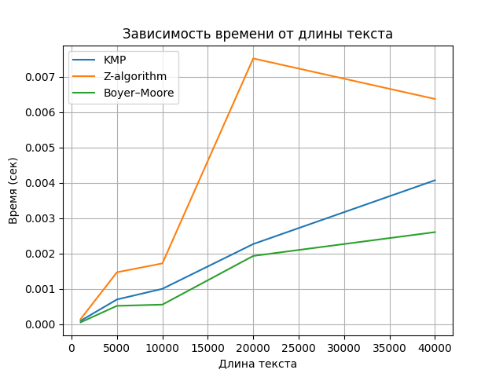
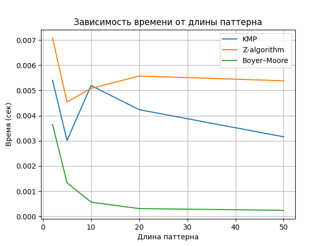
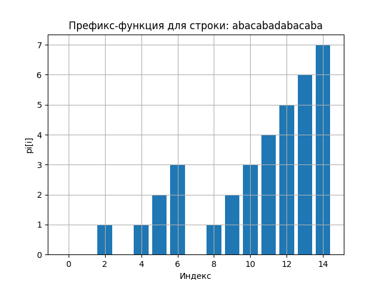
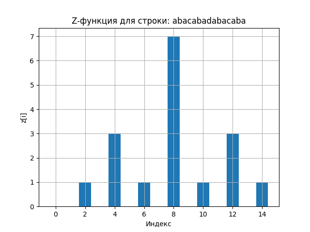

# Отчет по лабораторной работе 11
# Алгоритмы на строках

**Дата:** 2025-13-12
**Семестр:** 5
**Группа:** ПИЖ-б-о-23-1
**Дисциплина:** Анализ сложности алгоритмов
**Студент:** Герасименко Константин Васильевич

## Цель работы
Изучить специализированные алгоритмы для эффективной работы со строками. Освоить методы поиска подстрок, вычисление префикс-функции и Z-функции. Получить практические навыки реализации и анализа алгоритмов обработки строк, исследовать их производительность

## Теоретическая часть
Префикс-функция: Для строки S длиной n - массив π[0..n-1], где π[i] - длина наибольшего
собственного префикса, который является суффиксом подстроки S[0..i]. Сложность вычисления:
O(n).
Алгоритм Кнута-Морриса-Пратта (KMP): Эффективный алгоритм поиска подстроки,
использующий префикс-функцию. Сложность: O(n + m).
Z-функция: Для строки S длиной n - массив z[0..n-1], где z[i] - длина наибольшего общего
префикса строки S и суффикса S[i..n-1]. Сложность вычисления: O(n).
Поиск подстроки: Помимо KMP существуют алгоритмы Бойера-Мура, Рабина-Карпа, каждый со
своими особенностями и областью применения

## Практическая часть
### prefix_function.py, kmp_search.py и z_function
В файле prefix_function.py реализована префикс-функция строки. Эта функция для каждой позиции в строке вычисляет длину наибольшего собственного префикса, который одновременно является суффиксом подстроки до этой позиции. Она используется для оптимизации поиска подстроки и служит основой алгоритма Кнута–Морриса–Пратта (KMP), позволяя не возвращаться назад при несовпадении символов.

Файл kmp_search.py содержит реализацию самого алгоритма KMP для поиска всех вхождений паттерна в тексте. Сначала формируется конкатенация паттерна и текста через разделитель, затем строится префикс-функция этой строки. Используя значения префикс-функции, алгоритм быстро определяет позиции текста, где полностью совпадает паттерн, без повторного сравнения уже проверенных символов.

В z_function.py реализован алгоритм вычисления Z-функции строки. Для каждой позиции строки Z-функция показывает длину наибольшего префикса строки, начинающегося с этой позиции. На её основе можно эффективно искать подстроку в тексте и анализировать повторяющиеся или периодические структуры в строке. Алгоритм работает за линейное время благодаря использованию интервала [left, right], который хранит текущий известный префикс.

### string_matching.py
```python
# Алгоритм Бойера–Мура
def bad_char_table(pattern):
    """
    Таблица плохих символов:
    для каждого символа запоминаем его последнюю позицию в шаблоне
    """
    table = {}
    for i in range(len(pattern)):
        table[pattern[i]] = i
    return table


def boyer_moore(text, pattern):
    """
    Возвращает список индексов,
    где pattern встречается в text
    """
    n = len(text)
    m = len(pattern)

    if m == 0 or m > n:
        return []

    bad_char = bad_char_table(pattern)
    result = []

    shift = 0  # текущий сдвиг шаблона

    while shift <= n - m:
        j = m - 1  # начинаем сравнение с конца шаблона

        # сравниваем справа налево
        while j >= 0 and pattern[j] == text[shift + j]:
            j -= 1
        if j < 0:
            result.append(shift)
            shift += 1
        else:
            bad = text[shift + j]
            last = bad_char.get(bad, -1)
            shift += max(1, j - last)

    return result


def main():
    """
    Ввод:
    1 строка — текст
    2 строка — шаблон
    """
    text = input().strip()
    pattern = input().strip()

    positions = boyer_moore(text, pattern)

    if positions:
        for pos in positions:
            print(pos)
    else:
        print("NO")


if __name__ == '__main__':
    main()
```
В этом файле реализован алгоритм Бойера–Мура для поиска всех вхождений шаблона в тексте. Сначала строится таблица плохих символов, которая для каждого символа паттерна запоминает его последнюю позицию. Алгоритм сравнивает паттерн с текстом справа налево и при несовпадении использует таблицу плохих символов для оптимального сдвига шаблона, чтобы пропускать ненужные сравнения. Функция возвращает список индексов начала всех совпадений, а в основной части программы читаются строки текста и паттерна с клавиатуры, запускается поиск и выводятся найденные позиции или сообщение о том, что совпадений нет.

### unit.py
В этом файле реализованы unit-тесты для проверки корректности работы трёх алгоритмов поиска подстроки: KMP, Z-функции и Бойера–Мура. Для проверки используется наивный поиск, который служит эталоном. В тестах создаются случайные строки, периодические строки и строки с повторяющимися символами, проверяется совпадение алгоритмов с эталонным результатом, а также рассматриваются случаи, когда паттерн не найден, совпадает с текстом или длиннее текста. Для KMP перехватывается вывод с помощью `print`, чтобы преобразовать его в список индексов для сравнения с ожидаемым результатом.

### benchmark.py
```python
import time
import random
import string

import matplotlib.pyplot as plt

from kmp_search import kmp
from z_function import z_func
from prefix_function import p_fun
from string_matching import boyer_moore


def run_kmp(pattern, text):
    kmp(pattern, text)


def run_z(pattern, text):
    s = pattern + '#' + text
    z_func(s)


def run_bm(pattern, text):
    boyer_moore(text, pattern)


def random_string(n):
    return ''.join(random.choice(string.ascii_lowercase) for _ in range(n))


def repeated_string(n, ch='a'):
    return ch * n


def periodic_string(n):
    return ('abc' * (n // 3 + 1))[:n]


# Замер врмени

def measure(func, pattern, text, repeat=5):
    total = 0
    for _ in range(repeat):
        start = time.perf_counter()
        func(pattern, text)
        total += time.perf_counter() - start
    return total / repeat


def main():
    N = 100_000
    M = 10

    tests = [
        ("Случайная строка", random_string(N), random_string(M)),
        ("Периодическая строка", periodic_string(N), "abc"),
        ("Повторы (худший случай)", repeated_string(N), repeated_string(M)),
    ]

    for name, text, pattern in tests:
        print(f"\n{name}")
        print("-" * 40)

        print("KMP:", measure(run_kmp, pattern, text))
        print("Z  :", measure(run_z, pattern, text))
        print("BM :", measure(run_bm, pattern, text))
    text_sizes = [1_000, 5_000, 10_000, 20_000, 40_000]
    pattern = "abc"

    kmp_times = []
    z_times = []
    bm_times = []

    for n in text_sizes:
        text = random_string(n)
        kmp_times.append(measure(run_kmp, pattern, text))
        z_times.append(measure(run_z, pattern, text))
        bm_times.append(measure(run_bm, pattern, text))

    plt.figure()
    plt.plot(text_sizes, kmp_times, label="KMP")
    plt.plot(text_sizes, z_times, label="Z-algorithm")
    plt.plot(text_sizes, bm_times, label="Boyer–Moore")
    plt.xlabel("Длина текста")
    plt.ylabel("Время (сек)")
    plt.title("Зависимость времени от длины текста")
    plt.legend()
    plt.grid(True)
    plt.show()


    
    # ГРАФИК 2: ВРЕМЯ vs ДЛИНА ПАТТЕРНА
   

    text = random_string(30_000)
    pattern_sizes = [2, 5, 10, 20, 50]

    kmp_times = []
    z_times = []
    bm_times = []

    for m in pattern_sizes:
        pattern = random_string(m)
        kmp_times.append(measure(run_kmp, pattern, text))
        z_times.append(measure(run_z, pattern, text))
        bm_times.append(measure(run_bm, pattern, text))

    plt.figure()
    plt.plot(pattern_sizes, kmp_times, label="KMP")
    plt.plot(pattern_sizes, z_times, label="Z-algorithm")
    plt.plot(pattern_sizes, bm_times, label="Boyer–Moore")
    plt.xlabel("Длина паттерна")
    plt.ylabel("Время (сек)")
    plt.title("Зависимость времени от длины паттерна")
    plt.legend()
    plt.grid(True)
    plt.show()


    
    # ВИЗУАЛИЗАЦИЯ PREFIX-ФУНКЦИИ
    

    sample = "abacabadabacaba"
    pi = p_fun(sample)

    plt.figure()
    plt.bar(range(len(sample)), pi)
    plt.xlabel("Индекс")
    plt.ylabel("pi[i]")
    plt.title(f"Префикс-функция для строки: {sample}")
    plt.grid(True)
    plt.show()


    
    # ВИЗУАЛИЗАЦИЯ Z-ФУНКЦИИ
    

    z = z_func(sample)

    plt.figure()
    plt.bar(range(len(sample)), z)
    plt.xlabel("Индекс")
    plt.ylabel("z[i]")
    plt.title(f"Z-функция для строки: {sample}")
    plt.grid(True)
    plt.show()


if __name__ == '__main__':
    main()
```
В этом файле реализован бенчмарк и визуализация работы алгоритмов поиска подстроки. Сначала создаются функции для генерации случайных, повторяющихся и периодических строк. Затем замеряется среднее время выполнения алгоритмов KMP, Z-функции и Бойера–Мура на различных типах строк и при разных размерах текста и паттерна. Результаты выводятся в консоль и строятся графики зависимости времени работы от длины текста и длины паттерна. Также визуализируются работы префикс-функции и Z-функции на примере конкретной строки с помощью столбчатых диаграмм, показывающих значения функций для каждого индекса.

### tasks.py
```python
from prefix_function import p_fun
from z_function import z_func


# 1. Найти все вхождения паттерна в тексте
def find_pattern_kmp(pattern, text):
    """
    Возвращает список индексов, где pattern встречается в text
    """
    s = pattern + '#' + text
    pi = p_fun(s)
    result = []
    plen = len(pattern)
    for i in range(len(pattern) + 1, len(s)):
        if pi[i] == plen:
            result.append(i - 2 * plen)
    return result


def find_pattern_z(pattern, text):
    """
    Альтернатива через Z-функцию
    """
    s = pattern + '#' + text
    z = z_func(s)
    result = []
    plen = len(pattern)
    for i in range(plen + 1, len(s)):
        if z[i] == plen:
            result.append(i - plen - 1)
    return result


# 2. Найти минимальный период строки
def minimal_period(s):
    """
    Возвращает длину минимального периода строки
    """
    pi = p_fun(s)
    n = len(s)
    if n == 0:
        return 0
    period = n - pi[-1]
    if n % period == 0:
        return period
    return n


# 3. Проверка циклического сдвига
def is_cyclic_shift(s1, s2):
    """
    Проверяет, является ли s2 циклическим сдвигом s1
    """
    if len(s1) != len(s2):
        return False
    doubled = s1 + s1
    return s2 in doubled


if __name__ == '__main__':
    text = "abcabcabcabc"
    pattern = "abc"
    print("Вхождения (KMP):", find_pattern_kmp(pattern, text))
    print("Вхождения (Z):", find_pattern_z(pattern, text))

    s = "abcabcabc"
    print("Минимальный период:", minimal_period(s))

    a = "abcd"
    b = "cdab"
    print(f"'{b}' циклический сдвиг '{a}'?", is_cyclic_shift(a, b))
```
В этом файле реализованы три задачи по работе со строками. Первая функция находит все вхождения паттерна в тексте с использованием алгоритмов KMP или Z-функции и возвращает список позиций начала совпадений. Вторая функция вычисляет минимальный период строки, используя префикс-функцию, чтобы определить наименьшую подстроку, которая повторяется по всей длине строки. Третья функция проверяет, является ли одна строка циклическим сдвигом другой, объединяя первую строку сама с собой и проверяя, содержится ли вторая строка в этом удвоенном варианте. В блоке `__main__` эти функции демонстрируются на примерах, выводя результаты в консоль.

### Анализ результатов





Для отчета можно описать это так:

В работе проведено сравнение эффективности трёх алгоритмов поиска подстрок: Кнута–Морриса–Пратта (KMP), Z-функции и Бойера–Мура. Измерялось среднее время выполнения на строках различной длины и структуры: случайных, периодических и содержащих повторяющиеся символы. Анализ показал, что производительность алгоритмов зависит от характеристик текста и паттерна. KMP и Z-функция показывают стабильное линейное время в большинстве случаев, особенно на строках с повторениями, тогда как Бойер–Мур быстрее на длинных паттернах и случайных текстах, но может уступать на регулярных или сильно повторяющихся данных. На основе этих наблюдений определены области оптимального применения: KMP и Z-функция подходят для строк с большим количеством повторов или коротких паттернов, Бойер–Мур эффективен для длинных текстов и паттернов с разнообразными символами.

## Контрольные вопросы

1. Что такое префикс-функция строки? Как она используется в алгоритме Кнута-Морриса-Пратта(KMP)? - Префикс-функция строки для каждой позиции показывает длину наибольшего собственного префикса подстроки, который совпадает с её суффиксом. В алгоритме Кнута–Морриса–Пратта (KMP) она используется для определения, сколько символов можно пропустить при несовпадении паттерна и текста, что позволяет избежать повторного сравнения уже проверенных символов и обеспечивает линейное время поиска.

2.  В чем основное преимущество алгоритма KMP перед наивным алгоритмом поиска подстроки?
Проиллюстрируйте на примере. - Основное преимущество алгоритма KMP перед наивным поиском заключается в том, что KMP не возвращается назад по тексту при несовпадении символов, используя информацию о префикс-функции паттерна для пропуска проверенных символов.

Например, при поиске паттерна `"abab"` в тексте `"ababab"` наивный алгоритм при несовпадении проверяет каждую позицию заново, делая лишние сравнения. KMP, используя префикс-функцию `[0,0,1,2]`, сразу сдвигает паттерн на 2 позиции после частичного совпадения, избегая повторных проверок и ускоряя поиск.

3. Опишите, что такое Z-функция строки. Как с ее помощью можно решить задачу поиска подстроки? - Z-функция строки для каждой позиции показывает длину наибольшего префикса строки, начинающегося с этой позиции, который совпадает с её началом. Для поиска подстроки в тексте строится конкатенация паттерна и текста через разделитель, вычисляется Z-функция этой строки, и все позиции, где значение Z-функции равно длине паттерна, соответствуют началу вхождений паттерна в тексте.

4. В чем заключается идея алгоритма Бойера-Мура? Какие эвристики он использует для ускорения
поиска? - Идея алгоритма Бойера–Мура заключается в том, чтобы при поиске паттерна в тексте сравнивать символы справа налево и максимально сдвигать шаблон при несовпадении, избегая проверки каждой позиции подряд. Для ускорения поиска он использует две основные эвристики: «плохой символ», которая позволяет сдвигать паттерн до ближайшей позиции, где последний встреченный несовпадающий символ присутствует в паттерне, и «хороший суффикс», учитывающую совпадения конца паттерна для дополнительного сдвига.

5. Для каких практических задач, помимо поиска подстроки, могут применяться префикс- и Z функции (например, поиск периода строки)? - Префикс- и Z-функции применяются не только для поиска подстрок, но и для анализа структуры строк. С их помощью можно находить минимальный период строки, проверять повторяющиеся и симметричные шаблоны, определять циклические сдвиги, строить сжатые представления строк и решать задачи биоинформатики, например, поиск повторов в ДНК. Они также используются в задачах текстового анализа, сжатия данных и проверки шаблонов в алгоритмах обработки строк.


