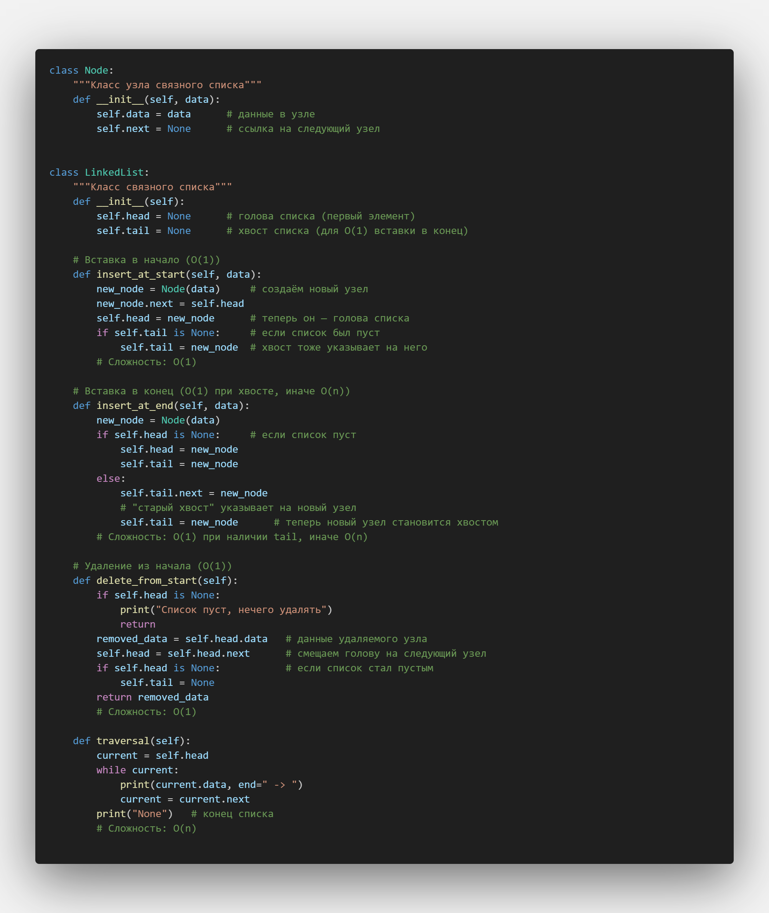
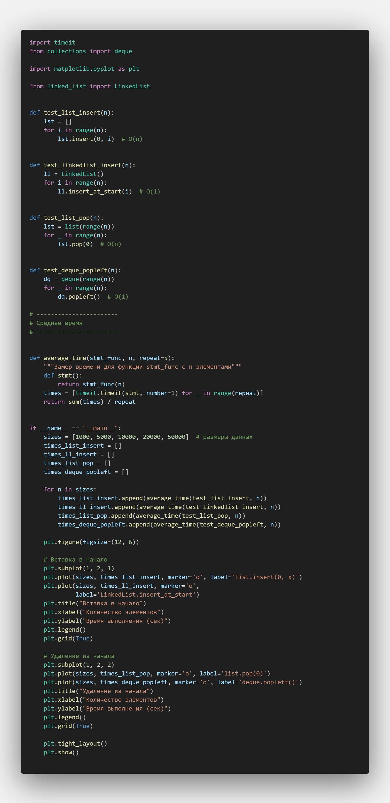
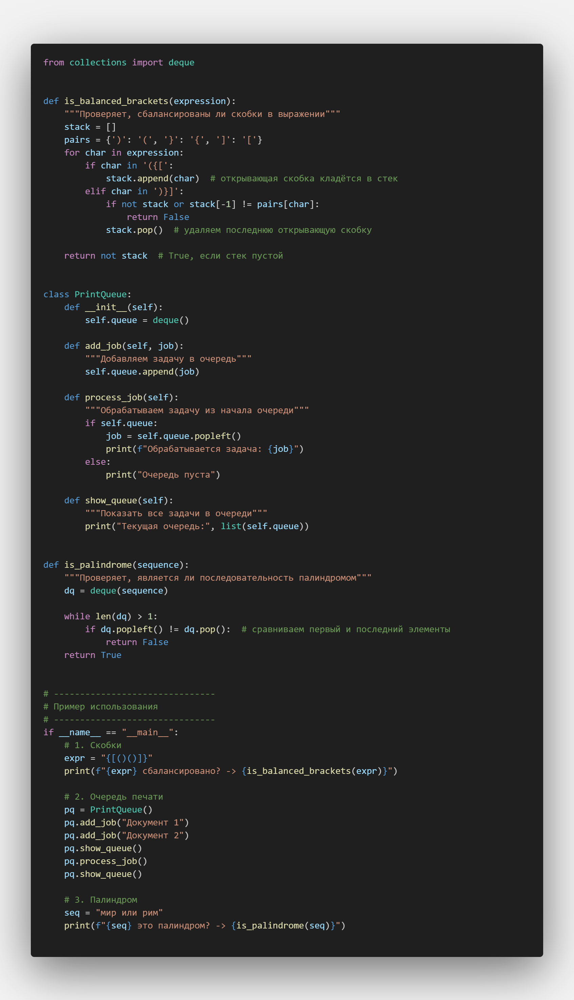
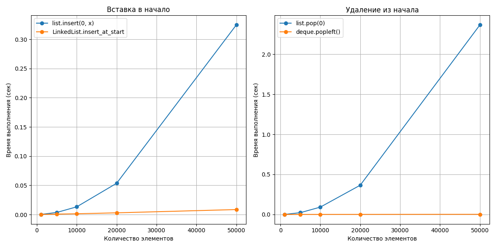

# Отчет по лабораторной работе 2
# Основные структуры данных. Анализ и применение

**Дата:** [2025-10-05]
**Семестр:** 5 
**Группа:** ПИЖ-б-о-23-1
**Дисциплина:** Анализ сложности алгоритмов
**Студент:** Герасименко Константин Васильевич

## Цель работы
Изучить понятие и особенности базовых абстрактных типов данных (стек, очередь, дек,
связный список) и их реализаций в Python. Научиться выбирать оптимальную структуру данных для
решения конкретной задачи, основываясь на анализе теоретической и практической сложности
операций. Получить навыки измерения производительности и применения структур данных для
решения практических задач.

## Теоретическая часть
 * __Список (list) в Python:__ Реализация динамического массива. Обеспечивает амортизированное
 время O(1) для добавления в конец (append). Вставка и удаление в середину имеют сложность
 O(n) из-за сдвига элементов. Доступ по индексу - O(1).
 * __Связный список (Linked List):__ Абстрактная структура данных, состоящая из узлов, где каждый
 узел содержит данные и ссылку на следующий элемент. Вставка и удаление в известное место
 (например, начало списка) выполняются за O(1). Доступ по индексу и поиск - O(n).
 * __Стек (Stack):__ Абстрактный тип данных, работающий по принципу LIFO (Last-In-First-Out).
 Основные операции: push (добавление, O(1)), pop (удаление с вершины, O(1)), peek (просмотр
 вершины, O(1)). В Python может быть реализован на основе списка.
 * __Очередь (Queue):__ Абстрактный тип данных, работающий по принципу FIFO (First-In-First-Out).
 Основные операции: enqueue (добавление в конец, O(1)), dequeue (удаление из начала, O(1)). В
 Python для эффективной реализации используется collections.deque.
 * __Дек (Deque, двусторонняя очередь):__ Абстрактный тип данных, позволяющий добавлять и
 удалять элементы как в начало, так и в конец. Все основные операции - O(1). В Python реализован
 в классе collections.deque

## Практическая часть

### Выполненные задачи
- [] Задача 1: [Реализовать класс Node и класс LinkedList.
 Реализовать методы: insert_at_start (O(1)), insert_at_end (O(n) или O(1) с хвостом),
 delete_from_start (O(1)), traversal (O(n))]
- [] Задача 2: [Использовать модуль timeit для замеров времени.
 Сравнение list и гипотетического LinkedList для операций вставки:
 Замерить время 1000 вставок в начало структуры. Для list (insert(0, item)) это
 будет O(n) на каждую операцию, для LinkedList (insert_at_start) - O(1).
 Продемонстрировать кардинальную разницу.
 Сравнение list и deque для реализации очереди:
 Замерить время 1000 операций dequeue (удаление из начала). Для list (pop(0)) это
 O(n), для deque (popleft()) - O(1). Продемонстрировать разницу.] 
- [] Задача 3: [Реализовать проверку сбалансированности скобок ({[()]}) с использованием стека
 (реализованного на list).
 Реализовать симуляцию обработки задач в очереди печати (использовать deque).
 Решить задачу "Палиндром" (проверка, является ли последовательность палиндромом) с
 использованием дека (deque).]

### Ключевые фрагменты кода
__linked_list.py__


В данном коде описан класс Node и самописный класс связного списка LinkedList

Класс `Node`
```python
class Node:
    def __init__(self, data):
        self.data = data      # данные узла
        self.next = None      # ссылка на следующий узел
```
Node (узел) — основной элемент списка.
Каждый узел содержит:
* data — данные (число, строка и т. д.)
* next — ссылку на следующий узел.

Класс `LinkedList`
```python
class LinkedList:
    def __init__(self):
        self.head = None   # первый элемент списка
        self.tail = None   # последний элемент списка
```
head — ссылка на начало списка.
tail — ссылка на конец списка (ускоряет вставку в конец).

Вставка в начало (O(1))
```python
def insert_at_start(self, data):
    new_node = Node(data)
    new_node.next = self.head
    self.head = new_node
    if self.tail is None:
        self.tail = new_node
```
Новый узел указывает на текущую голову.
head переносится на новый узел.
Если список пуст, tail тоже указывает на этот узел.
Сложность: O(1).

Вставка в конец (O(1) при наличии tail)
```python
def insert_at_end(self, data):
    new_node = Node(data)
    if self.head is None:
        self.head = new_node
        self.tail = new_node
    else:
        self.tail.next = new_node
        self.tail = new_node
```
Если список пуст — новый узел становится и головой, и хвостом.
Если нет — текущий хвост связывается с новым узлом, tail переносится.
Сложность: O(1) (с tail), иначе O(n).

Удаление из начала (O(1))
```python
def delete_from_start(self):
    if self.head is None:
        print("Список пуст")
        return
    removed_data = self.head.data
    self.head = self.head.next
    if self.head is None:
        self.tail = None
    return removed_data
```
Если список пуст — сообщение.
Иначе переносим head на следующий элемент.
Если после удаления список пуст — обнуляем tail.
Сложность: O(1).

Обход списка (Traversal)
```python
def traversal(self):
    current = self.head
    while current:
        print(current.data, end=" -> ")
        current = current.next
    print("None")
```
Проходим от головы до конца.
Выводим все элементы.
Сложность: O(n).

__performance_analysis.py__



Содержит в себе тесты добавления элементов в list и самописный Linkedlist и удаление элементов из List и deque. Также проводится сравнение работы данных операций и построение графиков.

Каждая функция проверяет скорость определённой операции с разным количеством элементов n.
```python
def test_list_insert(n):
    lst = []
    for i in range(n):
        lst.insert(0, i)  # O(n)
```
Вставка элементов в начало списка list.
Сложность: O(n), так как происходит сдвиг всех элементов.

```python
def test_linkedlist_insert(n):
    ll = LinkedList()
    for i in range(n):
        ll.insert_at_start(i)  # O(1)
```
Вставка в начало связного списка.
Сложность: O(1).
```python
def test_list_pop(n):
    lst = list(range(n))
    for _ in range(n):
        lst.pop(0)  # O(n)
```
Удаление элементов из начала списка.
Сложность: O(n), т.к. элементы сдвигаются.

```python
def test_deque_popleft(n):
    dq = deque(range(n))
    for _ in range(n):
        dq.popleft()  # O(1)
```
Удаление элементов из начала deque.
Сложность: O(1).

```python
def average_time(stmt_func, n, repeat=5):
    def stmt():
        return stmt_func(n)
    times = [timeit.timeit(stmt, number=1) for _ in range(repeat)]
    return sum(times) / repeat
```
Функция для замера времени
Выполняет функцию несколько раз (repeat) и берёт среднее время.
```python
for n in sizes:
    times_list_insert.append(average_time(test_list_insert, n))
    times_ll_insert.append(average_time(test_linkedlist_insert, n))
    times_list_pop.append(average_time(test_list_pop, n))
    times_deque_popleft.append(average_time(test_deque_popleft, n))
```
Для каждого размера считается время выполнения всех операций.
Результаты сохраняются в списках для построения графиков.

```python
plt.subplot(1, 2, 1)
plt.plot(sizes, times_list_insert, marker='o', label='list.insert(0, x)')
plt.plot(sizes, times_ll_insert, marker='o', label='LinkedList.insert_at_start')
```
Построение графиков
Левый график показывает время вставки в начало (list vs LinkedList).
```python
plt.subplot(1, 2, 2)
plt.plot(sizes, times_list_pop, marker='o', label='list.pop(0)')
plt.plot(sizes, times_deque_popleft, marker='o', label='deque.popleft()')
```
Правый график показывает время удаления из начала (list vs deque).

__task_solution.py__

В этом файле реализованы три классические задачи с использованием **стека (list)** и **очередей (deque)**.

## Проверка сбалансированности скобок
```python
def is_balanced_brackets(expression):
    stack = []
    pairs = {')': '(', '}': '{', ']': '['}
    for char in expression:
        if char in '({[':
            stack.append(char)
        elif char in ')}]':
            if not stack or stack[-1] != pairs[char]:
                return False
            stack.pop()
    return not stack
```
Используется стек (list).
Когда встречается открывающая скобка — кладём её в стек.
Когда встречается закрывающая скобка — проверяем, совпадает ли она с верхней в стеке.
В конце стек должен быть пустым — значит все скобки сбалансированы.

## Симуляция очереди печати
```python
class PrintQueue:
    def __init__(self):
        self.queue = deque()

    def add_job(self, job):
        self.queue.append(job)

    def process_job(self):
        if self.queue:
            job = self.queue.popleft()
            print(f"Обрабатывается задача: {job}")
        else:
            print("Очередь пуста")

    def show_queue(self):
        print("Текущая очередь:", list(self.queue))
```

Используется двусторонняя очередь (deque).
Метод add_job() добавляет задачу в конец очереди (enqueue).
Метод process_job() берёт задачу из начала (dequeue).
Очередь работает по принципу FIFO (First-In-First-Out).

## Проверка палиндрома
```python
def is_palindrome(sequence):
    dq = deque(sequence)
    while len(dq) > 1:
        if dq.popleft() != dq.pop():
            return False
    return True
```
Используется deque, чтобы сравнивать первый и последний элемент за O(1).
Убираем элементы с начала (popleft) и конца (pop).
Если они не совпадают — строка не палиндром.
Если все совпали — это палиндром.
## Результаты выполнения
В эксперименте были замерены времена выполнения операций вставки и удаления элементов для различных структур данных в Python.  
Для замеров использовались размеры входных данных от **1000 до 50000 элементов**.  


## 1. Вставка в начало списка
- **list.insert(0, x)**  
  Каждая вставка в начало требует сдвига всех элементов вправо.  
  Поэтому сложность **O(n)**.  
  При увеличении размера списка время растёт линейно.  

- **LinkedList.insert_at_start(x)**  
  Вставка в начало реализуется изменением ссылки головы на новый узел.  
  Это занимает **O(1)**.  
  Время практически не зависит от размера данных.  

**Результат:** На графике видно, что вставка в `list` растёт значительно быстрее, чем в `LinkedList`.  

## 2. Удаление из начала списка
- **list.pop(0)**  
  При удалении из начала элементы сдвигаются влево.  
  Это занимает **O(n)**.  
  Время выполнения растёт пропорционально размеру.  

- **deque.popleft()**  
  Удаление из начала очереди работает за **O(1)**.  
  `deque` специально оптимизирован для таких операций.  

**Результат:** На графике видно, что `deque` работает стабильно быстро, а `list.pop(0)` замедляется при росте размера.

### Пример работы программы
Результат работы task_solution.py
```bash
с/Алгоритмы/pizh2311_Gerasimenko_algorithms/3/task_solution.py"
{[()()]} сбалансировано? -> True
Текущая очередь: ['Документ 1', 'Документ 2']
Обрабатывается задача: Документ 1
Текущая очередь: ['Документ 2']
мир или рим это палиндром? -> True
PS D:\3 курс\Алгоритмы\pizh2311_Gerasimenko_algorithms\3> 
```


## Выводы
1. **list** хорошо подходит для доступа по индексу (**O(1)**), но плохо для вставки/удаления в начало (**O(n)**).  
2. **LinkedList** эффективен для вставки в начало (**O(1)**), но проигрывает при произвольном доступе (**O(n)**).  
3. **deque** — лучшая структура для реализации очередей, так как обеспечивает **O(1)** для вставки и удаления с обоих концов. 

## Ответы на контрольные вопросы
1. [В чем ключевое отличие динамического массива (list в Python) от связного списка с точки зрения сложности операций вставки в начало и доступа по индексу?] - [`list` (динамический массив) — быстрый доступ по индексу **O(1)**, но вставка в начало требует сдвига всех элементов (**O(n)**)
`LinkedList` — доступ по индексу медленный (**O(n)**), но вставка в начало за счёт изменения ссылок занимает **O(1)**]
2. [ Объясните принцип работы стека (LIFO) и очереди (FIFO). Приведите по два примера их практического использования.] - [**LIFO** (Last In, First Out) — способ организации данных, при котором последний добавленный элемент извлекается первым.
Например:
- Отмена действий в редакторах
- Стопка тарелок. Если положить тарелку №1, затем №2, затем №3, то первыми достанем в обратном порядке: №3 → №2 → №1.
**FIFO** (First In, First out) — способ организации данных, при котором первый добавленный элемент извлекается первым.
Например:
- Очередь печати
- Очередь на вход в кинотеатр или автобус]
3. [Почему операция удаления первого элемента из списка (list) в Python имеет сложность O(n), а издека (deque) - O(1)?] - [В `list` удаление из начала требует сдвига всех элементов влево, а в `deque` начало хранится как отдельный указатель, поэтому удаление — это просто изменение ссылки (**O(1)**)]
4. [Какую структуру данных вы бы выбрали для реализации системы отмены действий (undo) в
текстовом редакторе? Обоснуйте свой выбор] - [Подходит **стек**: каждое действие помещается в стек (`push`), при отмене достаём последнее действие (`pop`)]
5. [Замеры показали, что вставка 1000 элементов в начало списка заняла значительно больше времени, чем вставка в начало вашей реализации связного списка. Объясните результаты с точки зрения асимптотической сложности.] - [Вставка в начало списка (`list.insert(0, x)`) требует сдвига всех элементов и имеет сложность **O(n)**, тогда как в связном списке вставка в начало меняет только ссылку головы и выполняется за **O(1)**, поэтому она значительно быстрее.]