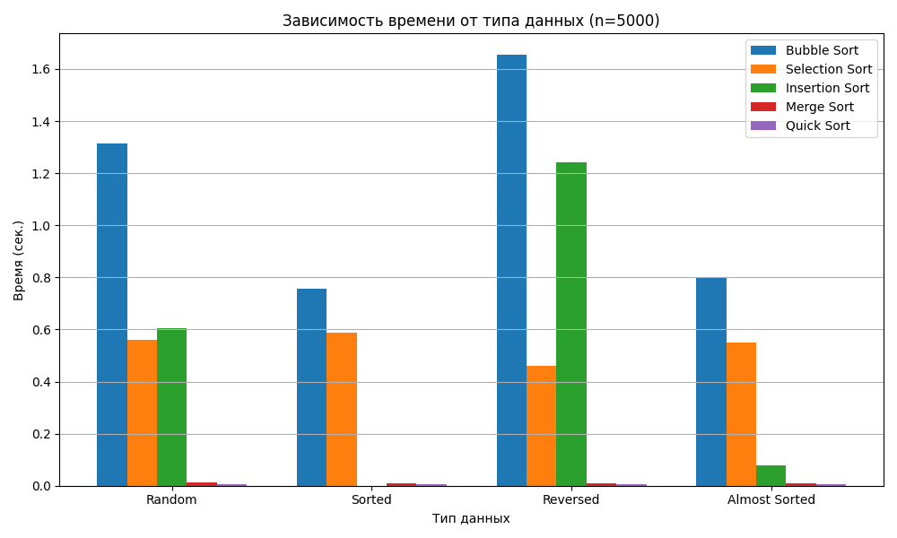

Герасименко Константин Васильевич  
Группа: ПИЖ-Б-О-23-1

## Лабораторная работа: сравнение алгоритмов сортировки

Цель работы: Изучить и реализовать основные алгоритмы сортировки. Провести их теоретический и практический сравнительный анализ по временной и пространственной сложности. Исследовать влияние начальной упорядоченности данных на эффективность алгоритмов Получить навыки эмпирического анализа производительности алгоритмов

### Ключевые моменты (фрагменты кода)

Пузырьковая сортировка — базовый квадратичный алгоритм:
```python
def bubble_sort(arr):
    for i in range(len(arr)):
        for j in range(0, len(arr) - i - 1):
            if arr[j] > arr[j + 1]:
                arr[j], arr[j + 1] = arr[j + 1], arr[j]
    return arr
```

Сортировка выбором — тоже O(n²), но с минимальным количеством перестановок:
```python
def selection_sort(arr):
    for i in range(len(arr)):
        min_index = i
        for j in range(i + 1, len(arr)):
            if arr[j] < arr[min_index]:
                min_index = j
        arr[i], arr[min_index] = arr[min_index], arr[i]
    return arr
```

Сортировка вставками — проста и особенно быстра на почти отсортированных данных:
```python
def insertion_sort(arr):
    for i in range(1, len(arr)):
        key = arr[i]
        j = i - 1
        while j >= 0 and arr[j] > key:
            arr[j + 1] = arr[j]
            j -= 1
        arr[j + 1] = key
    return arr
```

Сортировка слиянием — гарантированно O(n log n) и устойчивая:
```python
def merge_sort(arr):
    if len(arr) <= 1:
        return arr
    mid = len(arr) // 2
    left = merge_sort(arr[:mid])
    right = merge_sort(arr[mid:])
    return merge(left, right)
```

Быстрая сортировка — в среднем O(n log n), но чувствительна к выбору опорного элемента:
```python
def quick_sort(arr):
    if len(arr) <= 1:
        return arr
    pivot = arr[len(arr) // 2]
    left = [x for x in arr if x < pivot]
    middle = [x for x in arr if x == pivot]
    right = [x for x in arr if x > pivot]
    return quick_sort(left) + middle + quick_sort(right)
```

Для тестов создаются разные типы данных, в том числе «почти отсортированные» — это полезный случай для вставок:
```python
def generate_almost_sorted_array(size):
    arr = list(range(size))
    swap_count = int(size * 0.05)
    for _ in range(swap_count):
        i, j = random.sample(range(size), 2)
        arr[i], arr[j] = arr[j], arr[i]
    return arr
```

Перед измерениями всегда проверяется корректность результата сортировки, а время усредняется по нескольким прогонам:
```python
sorted_result = sort_func(data.copy())
if not is_sorted(sorted_result):
    continue

elapsed = timeit.timeit(
    stmt=lambda: sort_func(data.copy()),
    number=5
) / 5
```


### Сравнение практики с теорией



Теория говорит, что алгоритмы порядка O(n log n) — это та планка, к которой стоит стремиться для больших массивов: сортировка слиянием и средний случай быстрой сортировки обычно заметно опережают квадратичные методы. Практика это подтверждает: по мере роста массива квадратичные кривые уезжают вверх. При этом сортировка вставками на полностью или почти отсортированных массивах часто демонстрирует почти линейное поведение за счёт очень коротких сдвигов и хорошей кэш‑локальности. Обратный порядок, наоборот, «бьёт» по простым квадратичным методам. Merge Sort ведёт себя предсказуемо, потому что всегда даёт O(n log n), а Quick Sort может просесть, если опорный элемент выбирается неудачно и разбиения становятся несбалансированными.

### Ответы на контрольные вопросы 

1. Какие алгоритмы сортировки имеют сложность O(n²) в худшем случае, а какие — O(n log n)?
К квадратчным алгоритмам относятся пузырьковая сортировка, сортировка выбором и сортировка вставками: в их худшем и среднем случаях требуется порядка n² сравнений и перемещений. Сложность порядка n log n гарантирует сортировка слиянием, а быстрая сортировка достигает n log n в среднем. Однако у Quick Sort худший случай остаётся квадратичным при неудачном выборе опорного элемента, поэтому её поведение зависит от стратегии выбора pivot и структуры данных.
2. Почему сортировка вставками (Insertion Sort) эффективна для маленьких или почти отсортированных массивов?
У вставок очень малые накладные расходы и локальные перемещения: элементы сдвигаются на небольшие расстояния внутри уже почти упорядоченного участка. Поэтому, когда исходный массив маленький или почти отсортирован, реальное число операций резко уменьшается, и время становится близким к линейному. Дополнительно помогает хорошая кэш‑локальность, что ускоряет доступ к данным на практике.
3. В чем разница между устойчивой (stable) и неустойчивой (unstable) сортировкой? Приведите пример устойчивого и неустойчивого алгоритма.
Устойчивая сортировка сохраняет относительный порядок равных элементов, а неустойчивая — нет. Например, сортировка слиянием является устойчивой, как и типичная реализация сортировки вставками, тогда как сортировка выбором и классическая быстрая сортировка считаются неустойчивыми и могут поменять порядок одинаковых значений.
4. Опишите принцип работы алгоритма быстрой сортировки (Quick Sort). Что такое «опорный элемент» и как его выбор влияет на производительность?
Quick Sort выбирает опорный элемент и делит массив на три части: элементы меньше опорного, равные ему и больше него, после чего рекурсивно сортирует «левую» и «правую» части. Опорный элемент — это значение, относительно которого выполняется разбиение. Если pivot близок к медиане, подмассивы получаются сбалансированными, и алгоритм работает за n log n. Если pivot плохой (близок к минимуму или максимуму), разбиение становится сильно неравномерным, и время деградирует до n².
5. Сортировка слиянием (Merge Sort) гарантирует время O(n log n), но требует дополнительной памяти. В каких ситуациях этот алгоритм предпочтительнее быстрой сортировки?
Merge Sort выбирают, когда важна стабильность результата, предсказуемое время без риска провала в квадратичное, и когда распределение данных может быть неблагоприятным для выбора pivot. Это также уместно там, где дополнительная память не является проблемой и ценится детерминированность поведения (например, при повторяемых вычислениях или при постобработке записей, где важен порядок равных ключей).


