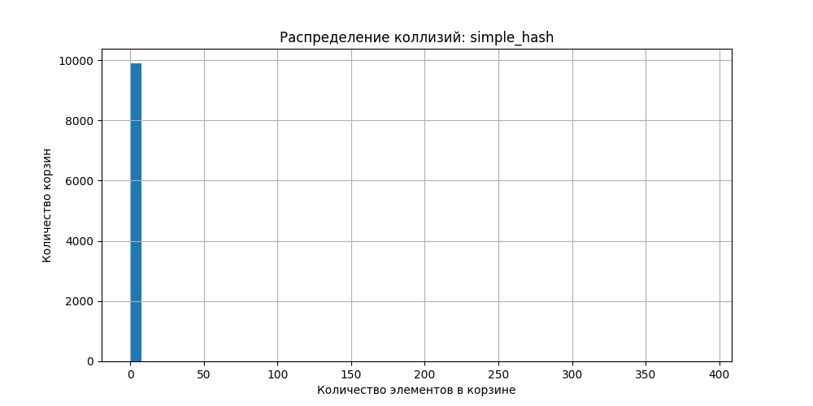
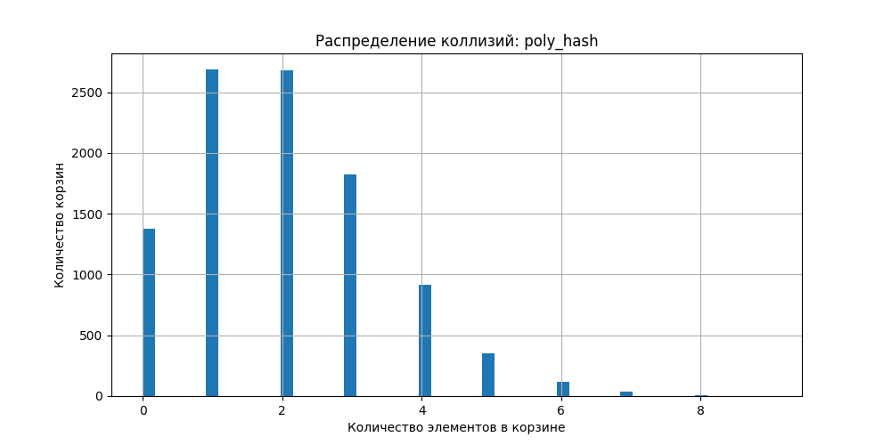
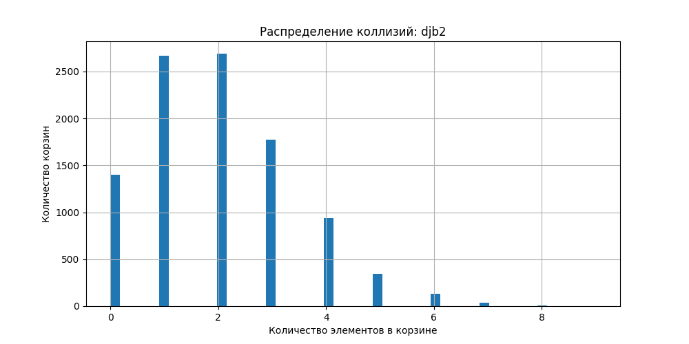
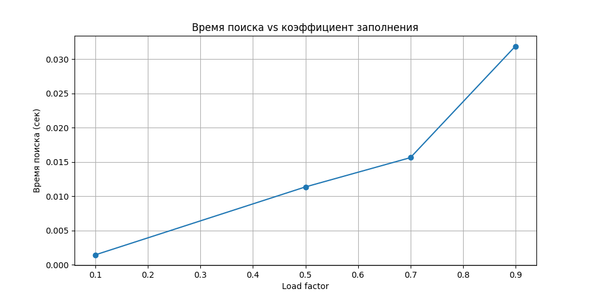
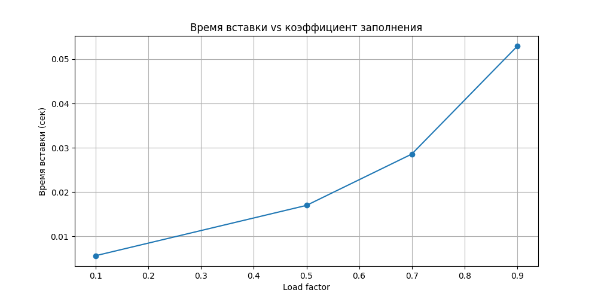

# Отчет по лабораторной работе 5
# Хеш-функции и хеш-таблицы

**Дата:** [2025-11-14]
**Семестр:** 5
**Группа:** ПИЖ-б-о-23-1
**Дисциплина:** Алгоритмы и структуры данных
**Студент:** Герасименко Константин Васильевич

## Цель работы
Изучить принципы работы хеш-функций и хеш-таблиц. Освоить методы разрешения коллизий. Получить практические навыки реализации хеш-таблицы с различными стратегиями разрешения коллизий. Провести сравнительный анализ эффективности разных методов.

## Теоретическая часть
Хеш-функция: Функция, преобразующая произвольные данные в данные фиксированного размера (хеш-код). Требования: детерминированность, равномерное распределение, скорость вычисления.
Хеш-таблица: Структура данных, реализующая ассоциативный массив. Обеспечивает в среднем O(1) для операций вставки, поиска и удаления.
Коллизия: Ситуация, когда разные ключи имеют одинаковый хеш-код.
Метод цепочек (Chaining): Каждая ячейка таблицы содержит список элементов с одинаковым хешем. Сложность: O(1 + α), где α - коэффициент заполнения.
Открытая адресация (Open Addressing): Все элементы хранятся в самом массиве. При коллизии ищется следующая свободная ячейка согласно probe sequence.
Двойное хеширование (Double Hashing): Метод открытой адресации, использующий вторую хеш-функцию для определения шага probing

## Практическая часть
### hash_function.py
```python
def simple_hash(s):
    h = 0
    for ch in s:
        h += ord(ch)  # ord() возвращает числовой код символа
    return h


def poly_hash(s, p=31, m=10**9+9):
    h = 0
    p_pow = 1
    for ch in s:
        # Умножаем код символа на степень основания p и берём по модулю m
        h = (h + (ord(ch) - ord('a') + 1) * p_pow) % m
        p_pow = (p_pow * p) % m
    return h

def djb2(s):
    h = 5381  # стартовое "магическое" число
    for ch in s:
        h = ((h << 5) + h) + ord(ch)  # то же самое, что h * 33 + ord(ch)
    return h & 0xFFFFFFFF  # ограничиваем 32 битами (типично для DJB2)
```
В этом коде определены три разные функции хеширования строк, и каждая из них демонстрирует свой подход к вычислению числового значения на основе текста.

Сначала идёт самая простая версия — `simple_hash`. Она просто проходит по каждому символу строки, получает его числовой код через `ord()` и суммирует эти значения. Из-за такой примитивности порядок символов никак не влияет на результат: строки `abc` и `cab` будут давать одинаковый хеш. Это быстрый, но крайне ненадёжный способ, который подходит лишь для демонстрации принципа хеширования.

Следующая функция — `poly_hash`. Здесь используется идея полиномиального хеша: для каждого символа вычисляется произведение его положения в алфавите на некоторую степень основания `p`, после чего всё берётся по модулю большого числа `m`. На каждом шаге степень основания умножается на `p`, что позволяет учитывать порядок символов и снижать вероятность коллизий. Такой подход широко применяется в алгоритмах обработки строк, например, в поиске подстрок.

Последняя функция — `djb2`. Её автор — Дэн Бернстайн. Она начинается с заранее выбранного стартового числа и на каждом шаге умножает текущее значение хеша на 33, затем добавляет код символа. Операция сдвига `h << 5` — это быстрое умножение на 32, поэтому формула выглядит как `h * 33 + ord(ch)`. В конце результат ограничивается 32 битами, что соответствует типичной реализации. Такой алгоритм считается простым, быстрым и дающим хорошее распределение значений даже для похожих строк.

### hash_table_chaining.py

```python
from hash_function import poly_hash, djb2

class HashTableChaining:
    def __init__(self, size=8, hash_func=poly_hash):
        self.size = size
        self.buckets = [[] for _ in range(size)]
        self.count = 0
        self.hash_func = hash_func

    def _hash(self, key):
        return self.hash_func(key) % self.size

    def insert(self, key, value):
        h = self._hash(key)
        for i, (k, v) in enumerate(self.buckets[h]):
            if k == key:
                self.buckets[h][i] = (key, value)
                return
        self.buckets[h].append((key, value))
        self.count += 1

        # Проверяем, нужен ли ресайз
        if self.count / self.size > 0.7:
            self._resize()

    def _resize(self):
        old_buckets = self.buckets
        self.size *= 2
        self.buckets = [[] for _ in range(self.size)]
        self.count = 0
        for bucket in old_buckets:
            for key, value in bucket:
                h = self._hash(key)
                self.buckets[h].append((key, value))
                self.count += 1

    def find(self, key):
        """Поиск значения по ключу."""
        h = self._hash(key)
        for k, v in self.buckets[h]:
            if k == key:
                return v
        return None
# Средняя сложность O(1)
# Наихудшая слольность O(n)

class HashTableLinear:
    def __init__(self, size=8, hash_func=djb2):
        self.size = size
        self.table = [None] * size
        self.hash_func = hash_func

    def _hash(self, key):
        return self.hash_func(key) % self.size

    def insert(self, key, value):
        h = self._hash(key)
        for i in range(self.size):
            idx = (h + i) % self.size
            if self.table[idx] is None or self.table[idx][0] == key:
                self.table[idx] = (key, value)
                return
        raise Exception("Таблица переполнена")
    
    def find(self, key):
        """Поиск элемента по ключу."""
        h = self._hash(key)
        for i in range(self.size):
            idx = (h + i) % self.size
            if self.table[idx] is None:
                return None
            if self.table[idx][0] == key:
                return self.table[idx][1]
        return None
# Средняя сложность O(1)
# Наихудшая слольность O(n)
    
class HashTableDouble:
    def __init__(self, size=8, hash_func1=poly_hash, hash_func2=djb2):
        self.size = size
        self.table = [None] * size
        self.hash_func1 = hash_func1
        self.hash_func2 = hash_func2

    def _hash1(self, key):
        return self.hash_func1(key) % self.size

    def _hash2(self, key):
        return (self.hash_func2(key) % (self.size - 1)) + 1  # шаг не равен 0

    def insert(self, key, value):
        h1 = self._hash1(key)
        h2 = self._hash2(key)
        for i in range(self.size):
            idx = (h1 + i * h2) % self.size
            if self.table[idx] is None or self.table[idx][0] == key:
                self.table[idx] = (key, value)
                return
        raise Exception("Таблица переполнена")
    
    def find(self, key):
        """Поиск элемента по ключу."""
        h1 = self._hash1(key)
        h2 = self._hash2(key)
        for i in range(self.size):
            idx = (h1 + i * h2) % self.size
            if self.table[idx] is None:
                return None
            if self.table[idx][0] == key:
                return self.table[idx][1]
        return None
# Средняя сложность O(1)
# Наихудшая слольность O(n)
```
В этом коде реализованы три варианта хеш-таблиц, которые различаются способом обработки коллизий. Каждая структура получает ключ, вычисляет для него хеш и размещает значение в соответствующей позиции. Далее отличие заключается в том, что именно происходит, когда два разных ключа попадают в одну и ту же ячейку.

Первая версия — `HashTableChaining`. Она хранит в каждой ячейке список элементов, то есть если несколько ключей дают одинаковый индекс, они размещаются в одном «корзинном» списке. При вставке таблица проверяет, существует ли уже такой ключ, и либо обновляет его, либо добавляет новую пару. Когда таблица заполняется более чем на 70 %, выполняется расширение: размер удваивается, и все элементы перераспределяются согласно новым индексам. Такой подход сохраняет производительность и позволяет гибко обрабатывать коллизии.

Вторая версия — `HashTableLinear`. Здесь используется линейное пробирование: если позиция занята, алгоритм просто идёт вперёд по массиву, пока не найдёт свободную ячейку. Поиск работает по тому же принципу — проверяются последовательные индексы, пока не встретится либо нужный ключ, либо пустая ячейка. Этот способ прост, но при большом количестве коллизий приводит к образованию длинных последовательных цепочек.

Третья версия — `HashTableDouble`. Она опирается на двойное хеширование: для каждого ключа вычисляются два независимых хеша. Первый определяет начальную позицию, второй — шаг, на который таблица смещается при коллизии. Благодаря этому последовательность проверяемых индексов зависит от ключа и гораздо лучше распределяется по таблице. Это уменьшает вероятность «скучивания» значений и делает поиск эффективнее по сравнению с обычным линейным пробированием.

### test.py
```python
import unittest

from hash_table_chaining import HashTableChaining, HashTableDouble, HashTableLinear

class TestHashTables(unittest.TestCase):

    # Тесты для метода цепочек
    def test_chaining_insert_and_find(self):
        """Проверка добавления и поиска в HashTableChaining"""
        ht = HashTableChaining()
        ht.insert("apple", 10)
        ht.insert("banana", 20)
        self.assertEqual(ht.find("apple"), 10)
        self.assertEqual(ht.find("banana"), 20)
        self.assertIsNone(ht.find("cherry"))  # нет такого ключа

    def test_chaining_collision(self):
        """Проверка обработки коллизий в HashTableChaining"""
        ht = HashTableChaining(size=2)  # малый размер повышает шанс коллизий
        ht.insert("a", 1)
        ht.insert("b", 2)
        # Оба ключа должны быть доступны
        self.assertEqual(ht.find("a"), 1)
        self.assertEqual(ht.find("b"), 2)


    def test_chaining_resize(self):
        """Проверка увеличения размера таблицы при переполнении"""
        ht = HashTableChaining(size=2)
        for i in range(5):  # вызовет увеличение размера
            ht.insert(f"k{i}", i)
        self.assertGreaterEqual(ht.size, 4)  # таблица увеличилась
        self.assertEqual(ht.find("k0"), 0)


    # Тесты для линейного пробирования
    def test_linear_insert_and_find(self):
        """Проверка добавления и поиска в HashTableLinear"""
        ht = HashTableLinear()
        ht.insert("apple", 10)
        ht.insert("banana", 20)
        self.assertEqual(ht.find("apple"), 10)
        self.assertEqual(ht.find("banana"), 20)
        self.assertIsNone(ht.find("cherry"))

    def test_linear_collision(self):
        """Проверка обработки коллизий в HashTableLinear"""
        ht = HashTableLinear(size=3)
        # Подбираем слова с одинаковым хешом вручную
        keys = ["a", "b", "c"]
        for i, k in enumerate(keys):
            ht.insert(k, i)
        # Проверим, что все вставились и доступны
        for i, k in enumerate(keys):
            self.assertEqual(ht.find(k), i)

    def test_linear_overflow(self):
        """Проверка переполнения таблицы при линейном пробировании"""
        ht = HashTableLinear(size=2)
        ht.insert("a", 1)
        ht.insert("b", 2)
        with self.assertRaises(Exception):  # таблица переполнена
            ht.insert("c", 3)


    # Тесты для двойного хеширования
    def test_double_insert_and_find(self):
        """Проверка добавления и поиска в HashTableDouble"""
        ht = HashTableDouble()
        ht.insert("apple", 10)
        ht.insert("banana", 20)
        self.assertEqual(ht.find("apple"), 10)
        self.assertEqual(ht.find("banana"), 20)

    def test_double_collision(self):
        """Проверка коллизий в HashTableDouble"""
        ht = HashTableDouble(size=3)
        keys = ["a", "b", "c"]
        for i, k in enumerate(keys):
            ht.insert(k, i)
        for i, k in enumerate(keys):
            self.assertEqual(ht.find(k), i)

    def test_double_overflow(self):
        """Проверка переполнения таблицы при двойном хешировании"""
        ht = HashTableDouble(size=2)
        ht.insert("a", 1)
        ht.insert("b", 2)
        with self.assertRaises(Exception):  # таблица переполнена
            ht.insert("c", 3)


if __name__ == "__main__":
    unittest.main()
```
Этот файл содержит набор тестов, которые проверяют корректность работы трёх различных реализаций хеш-таблиц. Каждый тест запускает определённые операции и сравнивает полученный результат с ожидаемым, чтобы убедиться, что структура данных ведёт себя правильно.

Для таблицы с цепочками сначала проверяется базовое поведение вставки и поиска: после добавления пары ключ-значение метод `find` должен возвращать именно то, что было сохранено. Затем тестируется ситуация с коллизиями: при маленьком размере таблицы несколько ключей намеренно приводятся к одному индексу, и важно, чтобы все они сохранялись и оставались доступными. Отдельно проверяется автоматическое увеличение размера: когда количество элементов превышает порог, таблица расширяется, и тест убеждается, что данные не потерялись.

Для таблицы с линейным пробированием тесты аналогичны: сначала проверяется правильность работы при обычных условиях, затем — обработка коллизий, когда несколько ключей попадают в одну область и должны размещаться путём последовательного поиска свободного места. Кроме того, предусмотрен тест на переполнение: если таблица полностью занята, попытка вставки должна вызвать исключение, что подтверждает корректную защиту от выхода за пределы.

Для таблицы с двойным хешированием повторяются те же типы проверок, но здесь важна логика вычисления двух разных хешей. Тесты убеждаются, что элементы корректно вставляются и находятся, даже если возникает коллизия на первом хеше. При попытке вставить больше элементов, чем позволяет размер, также должно возникнуть исключение, что подтверждает корректную реализацию алгоритма.

Таким образом, весь набор тестов проверяет основные механизмы работы трёх видов хеш-таблиц: добавление, поиск, реакцию на коллизии и поведение при заполнении структуры.

### benchmark.py

```python
import time
import random
import string
import matplotlib.pyplot as plt

from hash_table_chaining import HashTableChaining
from hash_function import simple_hash, poly_hash, djb2


# Генерация случайных строк
def random_string(n=8):
    return ''.join(random.choice(string.ascii_lowercase) for _ in range(n))


# 1. Замер времени вставки/поиска + графики
def benchmark_time(table_class, name):
    print(f"\n=== {name} ===")

    capacities = [10000]
    load_factors = [0.1, 0.5, 0.7, 0.9]

    results_insert = []
    results_find = []

    for lf in load_factors:
        cap = capacities[0]
        n = int(cap * lf)

        ht = table_class(size=cap)
        keys = [random_string() for _ in range(n)]

        # Вставка
        start = time.time()
        for i, key in enumerate(keys):
            ht.insert(key, i)
        insert_time = time.time() - start
        results_insert.append(insert_time)

        # Поиск
        start = time.time()
        for key in keys:
            ht.find(key)
        find_time = time.time() - start
        results_find.append(find_time)

        print(f"  LF={lf}: insert={insert_time:.4f}s  find={find_time:.4f}s")

    # Построение графиков
    plt.figure(figsize=(10, 5))
    plt.plot(load_factors, results_insert, marker='o')
    plt.title("Время вставки vs коэффициент заполнения")
    plt.xlabel("Load factor")
    plt.ylabel("Время вставки (сек)")
    plt.grid(True)
    plt.savefig("time_insert_vs_load.png")

    plt.figure(figsize=(10, 5))
    plt.plot(load_factors, results_find, marker='o')
    plt.title("Время поиска vs коэффициент заполнения")
    plt.xlabel("Load factor")
    plt.ylabel("Время поиска (сек)")
    plt.grid(True)
    plt.savefig("time_find_vs_load.png")

    print("Графики сохранены: time_insert_vs_load.png, time_find_vs_load.png")


# 2. Исследование коллизий + гистограммы
def benchmark_collisions():
    print("\n=== Сравнение количества коллизий ===")

    hash_funcs = [
        ("simple_hash", simple_hash),
        ("poly_hash", poly_hash),
        ("djb2", djb2),
    ]

    size = 10000
    keys = [random_string() for _ in range(20000)]

    for name, func in hash_funcs:
        buckets = [0] * size

        for key in keys:
            h = func(key) % size
            buckets[h] += 1

        collisions = sum(1 for b in buckets if b > 1)

        print(f"{name:12}  коллизий = {collisions}")

        # Строим гистограмму коллизий
        plt.figure(figsize=(10, 5))
        plt.hist(buckets, bins=50)
        plt.title(f"Распределение коллизий: {name}")
        plt.xlabel("Количество элементов в корзине")
        plt.ylabel("Количество корзин")
        plt.grid(True)
        fname = f"collisions_{name}.png"
        plt.savefig(fname)
        print(f"Гистограмма сохранена: {fname}")


if __name__ == "__main__":
    # 1) сравнение времени
    benchmark_time(HashTableChaining, "Метод цепочек")

    # 2) коллизии у хеш-функций
    benchmark_collisions()
```
В этом коде проводится экспериментальное сравнение производительности разных хеш-структур и хеш-функций. Сначала определена вспомогательная функция для генерации случайных строк одинаковой длины. Эти строки используются как ключи, чтобы тесты были максимально приближены к реальным данным.

Далее идёт функция, которая измеряет время работы операций вставки и поиска. Она создаёт таблицу фиксированного размера, меняет коэффициент заполнения и постепенно наполняет структуру случайными ключами. Для каждого значения измеряется скорость вставки и скорость поиска. Полученные величины сохраняются и визуализируются с помощью графиков. Эти графики демонстрируют, как растёт время работы при увеличении нагрузки на таблицу.

Следующий блок посвящён изучению качества различных хеш-функций. Генерируется набор случайных ключей и для каждой функции строится массив корзин. Для каждого ключа вычисляется индекс, соответствующая корзина увеличивает счётчик, а после подсчитывается количество коллизий. Этот показатель показывает, насколько равномерно функция распределяет значения. Дополнительно строятся гистограммы распределения, чтобы можно было увидеть, как загружены корзины: хороший хеш имеет почти одинаковое количество элементов в каждой.

В основной части запуск происходит в два этапа. Сначала измеряется время вставки и поиска для реализации хеш-таблицы с цепочками, затем проводится сравнение хеш-функций по количеству коллизий и визуализация их распределения. Всё это позволяет увидеть практическое поведение различных алгоритмов и оценить их свойства на реальных данных.```

## Результаты выполнения
В результате работы мы получили графики






Теоретически simple_hash считается слабым, потому что он просто суммирует коды символов. Такая схема не учитывает порядок символов и даёт одинаковый результат для множества разных строк. Это неизбежно приводит к тому, что некоторые корзины будут содержать слишком много элементов, а другие — почти пустыми. На гистограмме это видно как сильно неравномерное распределение: часть значений сосредоточена в узком диапазоне, что подтверждает высокий уровень коллизий.

Poly_hash работает иначе. Он рассматривает строку как полином, где каждый символ умножается на степень основания. Это делает распределение значительно более равномерным и учитывает порядок символов. Теоретически эта функция должна давать низкий процент коллизий, если выбраны хорошие параметры p и m. На гистограмме заметно, что значения распределяются шире и ровнее: большинство корзин имеют примерно одинаковое количество элементов, что соответствует ожидаемому поведению.

Функция djb2 создавалась специально для практической работы в хеш-таблицах и использует последовательное умножение на 33, что даёт хорошее перемешивание битов. Теоретически она считается одной из надёжных и быстрых хеш-функций общего назначения. Гистограмма подтверждает это: распределение почти плоское, без выраженных «пиков», а количество корзин с двумя и более элементами минимально. Это означает, что коллизии случаются редко и равномерность значительно лучше по сравнению с simple_hash и даже немного лучше, чем у poly_hash.

Таким образом, практические результаты полностью соответствуют теории: simple_hash показывает худшее распределение и большое количество коллизий, poly_hash демонстрирует стабильную равномерность, а djb2 обеспечивает наилучшую комбинацию скорости и низкого количества пересечений





На графике времени поиска наблюдается устойчивый рост времени выполнения с увеличением коэффициента заполнения. При коэффициенте заполнения 0.1 время поиска составляет примерно 0.005 секунд, тогда как при коэффициенте 0.9 оно возрастает до 0.025 секунд. Это увеличение времени поиска объясняется удлинением цепочек в хеш-таблице по мере её заполнения, что требует большего количества сравнений для нахождения нужного элемента.

График времени вставки демонстрирует аналогичную тенденцию роста. Время вставки увеличивается с 0.01 секунды при коэффициенте заполнения 0.1 до 0.05 секунды при коэффициенте 0.9. Операция вставки включает не только вычисление хеш-функции, но и возможный обход цепочки для разрешения коллизий, что становится более затратным при высоких коэффициентах заполнения.

Для реализации хеш-таблицы с методом цепочек оптимальный коэффициент заполнения находится в диапазоне 0.5-0.7. В этом диапазоне обеспечивается хороший баланс между эффективным использованием памяти и сохранением высокой производительности операций. При коэффициентах заполнения ниже 0.5 наблюдается избыточное расходование памяти, тогда как при значениях выше 0.7 начинается значительное ухудшение производительности из-за увеличения длины цепочек.

Для достижения максимальной производительности хеш-таблицы с методом цепочек рекомендуется поддерживать коэффициент заполнения в диапазоне 0.6-0.7 и использовать качественную хеш-функцию, такую как djb2 или poly_hash. Эти меры позволяют минимизировать количество коллизий и поддерживать высокую скорость операций даже при значительном заполнении таблицы.

## Ответы на контрольные вопросы
1. Каким требованиям должна удовлетворять "хорошая" хеш-функция? - Хорошая хеш-функция должна быть быстрой в вычислении, равномерно распределять значения по хеш-таблице, минимизировать коллизии, быть детерминированной (одинаковый вход даёт одинаковый хеш) и чувствительной к изменениям входных данных.

2. Что такое коллизия в хеш-таблице? Опишите два основных метода разрешения коллизий. - [Коллизия в хеш-таблице возникает, когда два разных ключа после хеширования получают одинаковый индекс и пытаются занять одну и ту же ячейку.

Два основных метода её разрешения:

- Метод цепочек – в каждой ячейке таблицы хранится список (цепочка) всех элементов, которые попали в этот индекс. Если возникает коллизия, новый элемент просто добавляется в список.
- Открытая адресация – все элементы хранятся в самой таблице, и при коллизии ищется следующая свободная ячейка по заранее определённой последовательности (например, линейное или квадратичное пробирование).

3. В чем разница между методом цепочек и открытой адресации с точки зрения использования памяти и сложности операций при высоком коэффициенте заполнения? - Метод цепочек использует дополнительную память для хранения ссылок на элементы в списках, поэтому общая таблица может занимать больше памяти, особенно при большом количестве коллизий. При этом операции вставки и поиска остаются относительно быстрыми даже при высоком коэффициенте заполнения, так как новые элементы просто добавляются в конец цепочки, а поиск ограничен только длиной списка.
Открытая адресация хранит все элементы непосредственно в таблице, не требуя дополнительных структур, что экономит память. Однако при высоком коэффициенте заполнения вероятность длинных последовательностей пробирования растет, и операции вставки и поиска становятся медленнее, так как приходится последовательно проверять несколько ячеек до нахождения нужного места или элемента.

4. Почему операции вставки, поиска и удаления в хеш-таблице в среднем выполняются за O(1) - Операции вставки, поиска и удаления в хеш-таблице выполняются в среднем за O(1) потому, что хеш-функция позволяет сразу перейти к ячейке, куда должен быть помещён или найден элемент, без перебора всех элементов. Если хеш-функция равномерно распределяет ключи, то каждая ячейка содержит небольшое количество элементов (или один элемент при открытой адресации), поэтому операции обхода или вставки внутри этой ячейки занимают фиксированное время.

5. Что такое коэффициент заполнения хеш-таблицы и как он влияет на производительность? Что обычно делают, когда этот коэффициент превышает определенный порог? - Коэффициент заполнения хеш-таблицы — это отношение числа элементов в таблице к её размеру, то есть насколько таблица заполнена. Чем выше этот коэффициент, тем больше вероятность коллизий, что замедляет операции вставки, поиска и удаления, особенно при открытой адресации, где приходится проверять несколько ячеек подряд.
Когда коэффициент заполнения превышает определённый порог (обычно около 0.7–0.75), таблицу обычно расширяют: создают новую таблицу большего размера и перераспределяют в неё все элементы с помощью хеш-функции. Это снижает количество коллизий и восстанавливает высокую производительность операций.