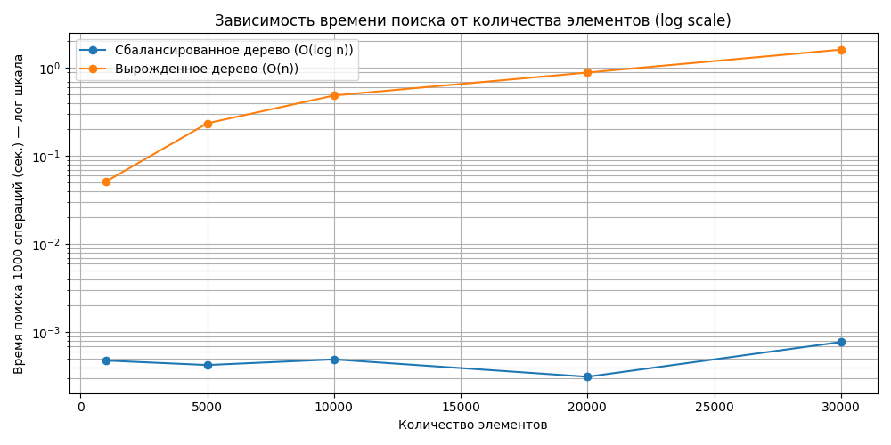

# Отчет по лабораторной работе №6
# Деревья. Бинарные деревья поиска

**Дата:** [2025-11-17]
**Семестр:** 5 семестр
**Группа:** ПИЖ-б-о-23-1
**Дисциплина:** Алгоритмы и структуры данных
**Студент:** Герасименко Константин Васильевич

## Цель работы
Изучить древовидные структуры данных, их свойства и применение. Освоить основные операции с бинарными деревьями поиска (BST). Получить практические навыки реализации BST на основе узлов (pointer-based), рекурсивных алгоритмов обхода и анализа их эффективности. Исследовать влияние сбалансированности дерева на производительность операций

## Теоретическая часть
Дерево: Рекурсивная структура данных, состоящая из узлов, где каждый узел имеет значение и
ссылки на дочерние узлы.
Бинарное дерево поиска (BST): Дерево, для которого выполняются следующие условия:
Значение в левом поддереве любого узла меньше значения в самом узле.
Значение в правом поддереве любого узла больше значения в самом узле.
Оба поддерева являются бинарными деревьями поиска.
Основные операции BST:
Вставка (Insert): Сложность: в среднем O(log n), в худшем (вырожденное дерево) O(n).
Поиск (Search): Сложность: в среднем O(log n), в худшем O(n).
Удаление (Delete): Сложность: в среднем O(log n), в худшем O(n). Имеет три случая:
удаление листа, узла с одним потомком, узла с двумя потомками.
Обход (Traversal):
In-order (левый-корень-правый): Посещает узлы в порядке возрастания.
Сложность O(n).
Pre-order (корень-левый-правый): Полезен для копирования структуры дерева.
Сложность O(n).
Post-order (левый-правый-корень): Полезен для удаления дерева. Сложность O(n).
Сбалансированные деревья: Деревья с контролем высоты (например, AVL, Красно-черные), которые гарантируют время операций O(log n) даже в худшем случае

## Практическая часть

### binary_search_tree.py

```python
class TreeNode:
    def __init__(self, value):
        self.value = value
        self.left = None
        self.right = None


class BinarySearchTree:
    def __init__(self):
        self.root = None

    def insert(self, value):
        # Средний случай: O(log n)
        # Худший случай (дерево перекошено): O(n)
        new_node = TreeNode(value)

        if self.root is None:
            self.root = new_node
            return

        current = self.root
        while True:
            if value < current.value:
                if current.left is None:
                    current.left = new_node
                    return
                current = current.left
            else:
                if current.right is None:
                    current.right = new_node
                    return
                current = current.right

    def search(self, value):
        # Средний случай: O(log n)
        # Худший случай: O(n)
        current = self.root
        while current:
            if value == current.value:
                return current
            elif value < current.value:
                current = current.left
            else:
                current = current.right
        return None

    def _deletenode(self, node, value):
        # Средний случай: O(log n)
        # Худший случай: O(n)
        if node is None:
            return None

        if value < node.value:
            node.left = self._deletenode(node.left, value)
        elif value > node.value:
            node.right = self._deletenode(node.right, value)
        else:
            # Случай 1: Нет детей — O(1)

            if node.left is None and node.right is None:
                return None

            # Случай 2: Один ребёнок — O(1)

            if node.left is None:
                return node.right
            if node.right is None:
                return node.left

            # Случай 3: Два ребёнка — O(h)
            # где h — высота дерева
            # (нужно найти min в правом поддереве)

            min_node = self.find_min(node.right)
            node.value = min_node.value
            node.right = self._deletenode(node.right, min_node.value)

        return node

    def delete(self, value):
        # Средний случай: O(log n)
        # Худший случай: O(n)
        self.root = self._deletenode(self.root, value)

    def find_min(self, node):
        # Средний случай: O(log n)
        # Худший случай: O(n)
        current = node
        while current.left:
            current = current.left
        return current

    def find_max(self, node):
        # Средний случай: O(log n)
        # Худший случай: O(n)
        current = node
        while current.right:
            current = current.right
        return current
    def inorder(self, node):
        # Левый - Корень - Правый
        # Сложность: O(n)
        if node:
            self.inorder(node.left)
            print(node.value)
            self.inorder(node.right)

    def preorder(self, node):
        # Корень - Левый - Правый
        # Сложность: O(n)
        if node:
            print(node.value)
            self.preorder(node.left)
            self.preorder(node.right)

    def postorder(self, node):
        # Левый - Правый - Корень
        # Сложность: O(n)
        if node:
            self.postorder(node.left)
            self.postorder(node.right)
            print(node.value)

    def inorder_iterative(self):
        # Сложность: O(n)
        # Мы посещаем каждый узел ровно один раз.
        
        stack = []
        current = self.root

        while current is not None or stack:
            # Идём в самый левый узел
            while current is not None:
                stack.append(current)
                current = current.left

            # Берём узел из стека
            current = stack.pop()
            print(current.value)

            # Переходим в правое поддерево
            current = current.right

    def height(self, node):
        # Сложность: O(n)
        if node is None:
            return -1  # или 0, если хочешь считать по-другому
        return 1 + max(self.height(node.left), self.height(node.right))

    def is_valid_bst(self):
        return self._validate(self.root, float('-inf'), float('inf'))
    
    def _validate(self, node, low, high):
        if node is None:
            return True

        # Проверка ключевого свойства BST
        if not (low < node.value < high):
            return False

        return (self._validate(node.left, low, node.value) and
                self._validate(node.right, node.value, high))
    
    def print_tree(self, node=None, indent="", is_left=True):
        if node is None:
            node = self.root
            if node is None:
                print("<empty>")
                return

        if node.right:
            self.print_tree(node.right, indent + ("    " if is_left else "│   "), False)

        print(indent + ("└── " if is_left else "┌── ") + str(node.value))

        if node.left:
            self.print_tree(node.left, indent + ("    " if is_left else "│   "), True)
```
В начале определяется класс узла дерева, который хранит значение и ссылки на левое и правое поддерево. Затем создаётся класс бинарного дерева поиска, внутри которого находится корень дерева. Вставка работает так: новый узел сравнивается с текущим, и в зависимости от того, меньше он или больше, происходит спуск либо влево, либо вправо, пока не найдётся свободное место. Поиск выполняется аналогично — значение сравнивается с текущим, и дерево проходит в нужное поддерево, пока либо не найдёт элемент, либо не дойдёт до пустого места.

Удаление реализовано рекурсивно. Когда значение найдено, рассматриваются три ситуации: если у узла нет детей, он просто удаляется; если у него один ребёнок, то на его место ставится этот ребёнок; если детей два, то значение заменяется минимальным элементом из правого поддерева, после чего этот элемент рекурсивно удаляется. Методы поиска минимума и максимума спускаются влево или вправо до конца, потому что минимальный элемент находится в самом левом узле, а максимальный — в правом.

Рекурсивные обходы дерева позволяют вывести элементы в нужном порядке. Прямой обход выводит значение до посещения поддеревьев, симметричный между обходом левого и правого, а обратный после них. Итеративная версия симметричного обхода использует стек для хранения пути к текущему узлу и позволяет обходить дерево без рекурсии.

Метод вычисления высоты определяет глубину дерева, считая максимальное расстояние от текущего узла до листа. Пустое дерево считается высотой минус один, чтобы лист имел высоту ноль. Проверка корректности BST использует минимально возможное и максимально возможное значение для каждого узла. Если значение выходит за рамки допустимого интервала, свойство BST нарушено. Для левого поддерева верхняя граница становится текущим значением, а для правого нижняя граница поднимается.

Метод визуализации дерева выводит узлы с отступами и символами для наглядного отображения структуры. Он сначала печатает правое поддерево, затем текущий узел и в конце левое поддерево, создавая понятное визуальное представление.

### tree_traversal.py
```python
from binary_search_tree import BinarySearchTree

if __name__ == '__main__':
    pc_info = """
    Конфигурация ПК:
    - Процессор: 11th Gen Intel(R) Core(TM) i5-1155G7 @ 2.50 GHz
    - Оперативная память: 16,0 ГБ (доступно: 15,8 ГБ)
    - Тип системы: 64-разрядная операционная система, процессор x64
    - ОС: Windows 11 Pro
    - Версия: 24H2
    - Сборка ОС: 26100.4946
    - Python: 3.13.3
    """
    tree = BinarySearchTree()
    tree.insert(5)
    tree.insert(3)
    tree.insert(7)

    tree.inorder(tree.root)
    print("\n")
    tree.preorder(tree.root)
    print("\n")
    tree.postorder(tree.root)
    print("\n")
    tree.inorder_iterative()
```
В самом начале импортируется класс бинарного дерева поиска, чтобы можно было создать дерево и работать с ним. Далее в блоке __main__ записана текстовая информация о конфигурации компьютера, но она никак не используется программой — это просто строка, которую можно вывести в отчёте, чтобы указать условия выполнения экспериментов.

После этого создаётся объект дерева. В него добавляются три значения: сначала 5, затем 3 и 7. При вставке 5 становится корнем, так как дерево пустое. Число 3, будучи меньше корня, попадает в левое поддерево. Число 7, будучи больше, помещается в правое поддерево. В итоге формируется простая структура: корень 5, слева узел 3, справа узел 7.

Затем вызывается симметричный обход дерева. Он проходит левое поддерево, затем сам корень и после этого правое поддерево. Для данной структуры вывод будет 3, 5, 7 — это отсортированный порядок значений.

После симметричного обхода вызывается прямой обход. Он сначала выводит корень, затем левое поддерево и потом правое, поэтому порядок получается 5, 3, 7.

Далее вызывается обратный обход. Этот алгоритм обходит левый узел, правый и только затем печатает корень. Для данного примера это даст последовательность 3, 7, 5.

Последним шагом запускается итеративная версия симметричного обхода. Она делает то же самое, что и рекурсивная, но вместо рекурсии использует стек, чтобы сохранять путь в дереве. Вывод снова будет 3, 5, 7.

### unit.py

```python
import unittest

from binary_search_tree import BinarySearchTree


class TestBinarySearchTree(unittest.TestCase):

    def setUp(self):
        self.tree = BinarySearchTree()

    # helpers 
    def insert_values(self, values):
        for v in values:
            self.tree.insert(v)

    # Проверка свойств BST
    def is_valid_bst(self, node, low=float("-inf"), high=float("inf")):
        if node is None:
            return True
        if not (low < node.value < high):
            return False
        return (self.is_valid_bst(node.left, low, node.value) and
                self.is_valid_bst(node.right, node.value, high))

    # TEST INSERT
    def test_insert(self):
        values = [5, 3, 7, 2, 4]
        self.insert_values(values)

        # Проверяем, что дерево стало корректным BST
        self.assertTrue(self.is_valid_bst(self.tree.root))

        # Проверяем, что можно найти каждое значение
        for v in values:
            self.assertIsNotNone(self.tree.search(v))

    # TEST SEARCH
    def test_search(self):
        self.insert_values([5, 3, 7])
        self.assertIsNotNone(self.tree.search(5))
        self.assertIsNotNone(self.tree.search(3))
        self.assertIsNotNone(self.tree.search(7))
        self.assertIsNone(self.tree.search(10))

    # TEST DELETE — удаление листа
    def test_delete_leaf(self):
        self.insert_values([5, 3, 7])
        self.tree.delete(3)
        self.assertIsNone(self.tree.search(3))
        self.assertTrue(self.is_valid_bst(self.tree.root))

    
    # TEST DELETE — удаление с одним ребёнком
    def test_delete_one_child(self):
        # У узла 3 есть только левый ребёнок (2)
        self.insert_values([5, 3, 2])
        self.tree.delete(3)
        self.assertIsNone(self.tree.search(3))
        self.assertTrue(self.is_valid_bst(self.tree.root))

    # TEST DELETE — удаление с двумя детьми
    def test_delete_two_children(self):
        # У 5 два потомка (3 и 7)
        self.insert_values([5, 3, 7, 6, 8])
        self.tree.delete(7)
        self.assertIsNone(self.tree.search(7))
        self.assertTrue(self.is_valid_bst(self.tree.root))

    # TEST HEIGHT
    def test_height(self):
        self.insert_values([5, 3, 7, 2, 4])
        h = self.tree.height(self.tree.root)
        self.assertEqual(h, 2)  # 5 → 3 → 2

    # TEST INORDER (sorted)
    def test_inorder(self):
        self.insert_values([5, 3, 7, 2, 4])

        result = []
        def capture_inorder(node):
            if node:
                capture_inorder(node.left)
                result.append(node.value)
                capture_inorder(node.right)

        capture_inorder(self.tree.root)
        self.assertEqual(result, [2, 3, 4, 5, 7])

    # TEST INORDER ITERATIVE
    def test_inorder_iterative(self):
        self.insert_values([5, 3, 7, 2, 4])

        output = []
        # временно переопределим print
        import builtins
        original_print = builtins.print
        builtins.print = lambda v: output.append(v)

        self.tree.inorder_iterative()

        builtins.print = original_print  # вернуть print

        self.assertEqual(output, [2, 3, 4, 5, 7])


if __name__ == '__main__':
    unittest.main()
```
Этот код представляет собой набор модульных тестов, которые проверяют работу бинарного дерева поиска. В начале создаётся новое дерево для каждого теста. Затем для разных операций вставки, поиска и удаления проверяется, сохраняется ли структура корректного BST и находятся ли нужные элементы. Проверяются ситуации удаления листа, узла с одним ребёнком и узла с двумя. Также тестируется вычисление высоты дерева, правильность симметричного обхода и корректная работа его итеративной версии.

### analysis.py

```python
import random
import time

import matplotlib.pyplot as plt

from binary_search_tree import BinarySearchTree


def build_balanced_tree(n):
    """Строит дерево, вставляя элементы в случайном порядке."""
    values = list(range(n))
    random.shuffle(values)
    tree = BinarySearchTree()
    for v in values:
        tree.insert(v)
    return tree


def build_degenerate_tree(n):
    """Строит дерево, вставляя элементы в отсортированном порядке."""
    tree = BinarySearchTree()
    for v in range(n):
        tree.insert(v)
    return tree


def measure_search_time(tree, n_search=1000):
    """Замеряет время поиска случайных элементов."""
    values = [random.randint(0, 10**9) for _ in range(n_search)]

    start = time.time()
    for v in values:
        tree.search(v)
    end = time.time()

    return end - start


# ДОБАВЛЯЕМ print_tree В КЛАСС

def bst_print_tree(self, node=None, indent="", is_left=True):
    """Текстовая визуализация дерева."""
    if node is None:
        node = self.root
        if node is None:
            print("<empty>")
            return

    if node.right:
        bst_print_tree(self, node.right, indent + ("    " if is_left else "│   "), False)

    print(indent + ("└── " if is_left else "┌── ") + str(node.value))

    if node.left:
        bst_print_tree(self, node.left, indent + ("    " if is_left else "│   "), True)


BinarySearchTree.print_tree = bst_print_tree

def run_experiment():
    sizes = [1000, 5000, 10000, 50000]

    print(f"{'Размер':10} {'Сбалансированное':20} {'Вырожденное':20}")
    print("-" * 55)

    for n in sizes:
        balanced = build_balanced_tree(n)
        t_bal = measure_search_time(balanced)

        degenerate = build_degenerate_tree(n)
        t_deg = measure_search_time(degenerate)

        print(f"{n:<10} {t_bal:<20.6f} {t_deg:<20.6f}")

def build_graphs():
    sizes = [1000, 5000, 10000, 20000, 30000]

    balanced_times = []
    degenerate_times = []

    for n in sizes:
        balanced = build_balanced_tree(n)
        degenerate = build_degenerate_tree(n)

        t_bal = measure_search_time(balanced)
        t_deg = measure_search_time(degenerate)

        balanced_times.append(t_bal)
        degenerate_times.append(t_deg)

        print(f"n={n}: balanced={t_bal:.6f}, degenerate={t_deg:.6f}")
    

    plt.figure(figsize=(10, 5))

    plt.semilogy(sizes, balanced_times, marker='o', label="Сбалансированное дерево (O(log n))")
    plt.semilogy(sizes, degenerate_times, marker='o', label="Вырожденное дерево (O(n))")

    plt.title("Зависимость времени поиска от количества элементов (log scale)")
    plt.xlabel("Количество элементов")
    plt.ylabel("Время поиска 1000 операций (сек.) — лог шкала")
    plt.grid(True, which="both")
    plt.legend()

    plt.tight_layout()
    plt.show(block=True)


if __name__ == '__main__':
    pc_info = """
    Конфигурация ПК:
    - Процессор: 11th Gen Intel(R) Core(TM) i5-1155G7 @ 2.50 GHz
    - Оперативная память: 16,0 ГБ (доступно: 15,8 ГБ)
    - Тип системы: 64-разрядная операционная система, процессор x64
    - ОС: Windows 11 Pro
    - Версия: 24H2
    - Сборка ОС: 26100.4946
    - Python: 3.13.3
    """
    values = list(range(1, 16))
    random.shuffle(values)

    tree_balanced = BinarySearchTree()
    for v in values:
        tree_balanced.insert(v)

    print("Случайный порядок:", values)
    print("Высота:", tree_balanced.height(tree_balanced.root))

    sorted_values = list(range(1, 16))

    tree_degenerate = BinarySearchTree()
    for v in sorted_values:
        tree_degenerate.insert(v)

    print("Отсортированный порядок:", sorted_values)
    print("Высота:", tree_degenerate.height(tree_degenerate.root))

    run_experiment()

    print("\nСбалансированное дерево:")
    tree_balanced.print_tree()

    print("\nВырожденное дерево:")
    tree_degenerate.print_tree()

    print("\nГРАФИКИ")
    build_graphs()
```
Этот код сравнивает два типа бинарных деревьев поиска: сбалансированное, построенное из случайных значений, и вырожденное, построенное из отсортированных. Он замеряет время выполнения тысячи операций поиска в каждом дереве, выводит результаты в таблице и строит графики в логарифмической шкале. Также программа умеет выводить дерево в текстовом виде. В конце создаются два примера деревьев, выводятся их высоты, запускается эксперимент и строятся графики.

#### Анализ зависимости времени поиска от количества элементов в деревьях


Сбалансированное дерево - время поиска растет медленно (O(log n)), даже при большом количестве элементов. График почти горизонтальный.

Вырожденное дерево - время поиска растет пропорционально количеству элементов (O(n)). График показывает прямую линейную зависимость.

Разница: при увеличении данных сбалансированное дерево работает намного быстрее. Для 10К элементов разница в скорости может быть в сотни раз.

## Ответы на контрольные вопросы
1. Сформулируйте основное свойство бинарного дерева поиска (BST) - у каждого узла все значения в левом поддереве строго меньше значения этого узла, а все значения в правом поддереве строго больше
2. Опишите алгоритм вставки нового элемента в BST. Какова сложность этой операции в сбалансированном и вырожденном дереве? - Алгоритм вставки работает так: начинается поиск позиции с корня, затем новый элемент сравнивается с текущим узлом и при меньшем значении переход идёт влево, при большем — вправо. Процесс продолжается до момента, пока не будет найдено пустое место, куда вставляется новый узел. Сложность в сбалансированном дереве равна логарифмической, так как высота дерева около log n. В вырожденном дереве она линейная, потому что структура превращается в цепочку, и путь может достигать длины n.
3.  Чем отличается обход дерева в глубину (DFS) от обхода в ширину (BFS)? Назовите виды DFS
обходов и их особенности - DFS идёт в глубину, то есть сначала погружается по одной ветке вниз, пока не дойдёт до конца, и только потом возвращается назад и переходит к другим веткам. BFS движется по уровням: сначала корень, затем все его дети, затем дети этих детей и так далее.
У DFS есть три основных варианта. Прямой обход начинает с корня, затем переходит к левому и правому поддереву, что удобно, когда нужно обрабатывать узлы сразу при встрече. Симметричный обход сначала проходит левое поддерево, потом узел, затем правое, что даёт отсортированный порядок для BST. Обратный обход сначала проходит оба поддерева, а сам узел обрабатывает в конце, что полезно, когда нужно сначала разобрать потомков, а потом родителя.
4.  Почему в вырожденном BST (например, когда элементы добавляются в отсортированном порядке) сложность операций поиска и вставки становится O(n)? - В вырожденном BST все узлы образуют «список» — каждый узел имеет только одного потомка. Из-за этого, чтобы найти или вставить элемент, приходится пройти почти все узлы, что даёт сложность **O(n)** вместо O(log n) для сбалансированного дерева.
5.  Что такое сбалансированное дерево (например, AVL-дерево) и как оно решает проблему вырождения BST? - Сбалансированное дерево - это BST, где высоты левого и правого поддеревьев почти равны. Например, AVL-дерево автоматически выполняет повороты при вставке/удалении, чтобы поддерживать баланс, что предотвращает вырождение и сохраняет операции за **O(log n)**.


