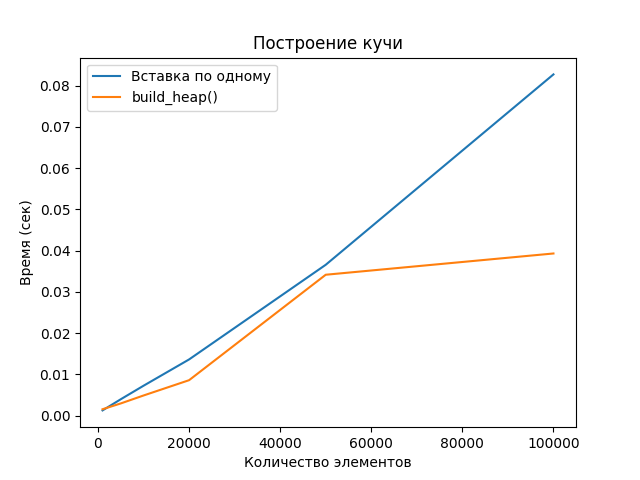

# Отчет по лабораторной работе 7
# Кучи

**Дата:** 2025-11-29
**Семестр:** 5
**Группа:** ПИЖ-б-о-23-1
**Дисциплина:** Анализ сложности алгоритмов
**Студент:** Герасименко Константин Васильевич

## Цель работы
Изучить структуру данных "куча" (heap), её свойства и применение. Освоить основные операции с кучей (добавление, извлечение корня) и алгоритм её построения. Получить практические навыки реализации кучи на основе массива (array-based), а не указателей Исследовать эффективность основных операций и применение кучи для сортировки и реализации приоритетной очереди.

## Теоретическая часть
Куча (Heap): Специализированная древовидная структура данных, удовлетворяющая свойству кучи. Является полным бинарным деревом (все уровни заполнены, кроме последнего, который заполняется слева направо).
Свойство кучи:
Min-Heap: Значение в любом узле меньше или равно значениям его потомков. Корень —
минимальный элемент.
Max-Heap: Значение в любом узле больше или равно значениям его потомков. Корень —
максимальный элемент.
Реализация: Куча эффективно реализуется на основе массива. Для узла с индексом i: 
Индекс родителя: (i-1)//2
Индекс левого потомка: 2*i + 1
Индекс правого потомка: 2*i + 2
Основные операции:
Вставка (Insert): Элемент добавляется в конец массива и "всплывает" (sift-up) до восстановления свойства кучи. Сложность: O(log n). Извлечение корня (Extract): Корень (элемент [0]) извлекается, последний элемент ставится на его место и "погружается"(sift-down) до восстановления свойства кучи. Сложность: O(log n). Построение кучи (Heapify): Преобразование произвольного массива в кучу. Может быть выполнено алгоритмом со сложностью O(n).

## Практическая часть
### heap.py
```python
class Heap:
    def __init__(self, is_min=True):
        self.data = []  # внутренний массив для хранения элементов кучи
        self.is_min = is_min  # True для min-кучи, False для max-кучи

    # Всплытие элемента вверх
    def _sift_up(self, index):
        parent = (index - 1) // 2
        while index > 0 and self._compare(self.data[index], self.data[parent]):
            # Меняем местами текущий элемент с родителем
            self.data[index], self.data[parent] = self.data[parent], self.data[index]
            index = parent
            parent = (index - 1) // 2
        # Сложность: O(log n)

    # Погружение элемента вниз
    def _sift_down(self, index):
        size = len(self.data)
        while True:
            left = 2 * index + 1
            right = 2 * index + 2
            target = index
            if left < size and self._compare(self.data[left],
                                             self.data[target]):
                target = left
            if right < size and self._compare(self.data[right],
                                              self.data[target]):
                target = right
            if target == index:
                break
            self.data[index], self.data[target] = self.data[target], self.data[index]
            index = target
        # Сложность: O(log n)

    # Метод сравнения в зависимости от типа кучи

    def _compare(self, child, parent):
        if self.is_min:
            return child < parent  # для min-кучи
        else:
            return child > parent  # для max-кучи
        # Сложность: O(1)

    # Вставка нового элемента
    def insert(self, value):
        self.data.append(value)
        self._sift_up(len(self.data) - 1)
        # Сложность: O(log n)

    # Извлечение корня (минимум для min-кучи, максимум для max-кучи)

    def extract(self):
        if not self.data:
            return None
        root = self.data[0]
        last = self.data.pop()
        if self.data:
            self.data[0] = last
            self._sift_down(0)
        return root
        # Сложность: O(log n)

    # Просмотр корня без извлечения
    def peek(self):
        if self.data:
            return self.data[0]
        return None
        # Сложность: O(1)

    # Построение кучи из массива
    def build_heap(self, array):
        self.data = array[:]
        # Погружаем элементы начиная с середины
        for i in range(len(self.data)//2 - 1, -1, -1):
            self._sift_down(i)
        # Сложность: O(n)
```
В данной реализации используется структура данных «бинарная куча». Она хранится во внутреннем списке, где элементы расположены так, чтобы каждый родитель удовлетворял свойству кучи: либо он меньше своих потомков (min-куча), либо больше (max-куча). Тип кучи выбирается при создании экземпляра с помощью флага.

При добавлении нового элемента он помещается в конец массива, а затем «всплывает» вверх. Это происходит за счёт обменов с родительскими элементами, пока не будет восстановлено корректное положение. Такой процесс обеспечивает логарифмическое время вставки.

Извлечение корня начинается с сохранения первого элемента. На его место помещается последний, после чего происходит «погружение» элемента вниз. Он сравнивается с потомками, и если нарушается свойство кучи, выполняется обмен. Операция продолжается, пока элемент не окажется на правильной позиции. Таким образом, удаление также выполняется за логарифмическое время.

Можно просматривать корневой элемент без удаления — эта операция работает за константное время.

Существует отдельный способ построения кучи из готового массива. Вместо последовательных вставок все элементы копируются в список, после чего выполняется погружение начиная от середины массива. Такой метод имеет линейную сложность и значительно эффективнее при построении кучи из большого набора данных.

Для сравнения элементов используется вспомогательная функция, которая учитывает тип кучи. В min-куче меньший элемент имеет приоритет, а в max-куче больший.

### heapsort.py
```python
from heap import Heap


def heapsort(array):
    # Шаг 1: строим max-кучу из массива
    heap = Heap(is_min=False)
    heap.build_heap(array)

    # Шаг 2: извлекаем элементы из кучи в отсортированном порядке
    sorted_array = []
    while heap.data:
        # Извлекаем корень (максимум) и добавляем в начало списка
        sorted_array.insert(0, heap.extract())  # вставка в начало списка

    return sorted_array


def heapsort_inplace(array):
    n = len(array)

    # Вспомогательная функция для _sift_down
    def sift_down(arr, start, end):
        root = start
        while True:
            left = 2 * root + 1
            right = 2 * root + 2
            largest = root
            if left <= end and arr[left] > arr[largest]:
                largest = left
            if right <= end and arr[right] > arr[largest]:
                largest = right
            if largest == root:
                break
            arr[root], arr[largest] = arr[largest], arr[root]
            root = largest

    # Шаг 1: Построение max-кучи
    for i in range(n // 2 - 1, -1, -1):
        sift_down(array, i, n - 1)

    # Шаг 2: Сортировка
    for end in range(n - 1, 0, -1):
        # Меняем корень с последним элементом
        array[0], array[end] = array[end], array[0]
        # Погружаем новый корень
        sift_down(array, 0, end - 1)

    return array
```
Функция получает массив и сначала превращает его в кучу. Причём создаётся max-куча, потому что алгоритму нужно каждый раз извлекать максимальный элемент, формируя итоговую последовательность по возрастанию. После построения кучи в цикле происходит извлечение корня — это всегда наибольшее значение. Этот элемент добавляется в начало результирующего списка. Таким образом, каждый следующий извлечённый элемент вытесняет более крупные числа вправо и массив становится отсортированным. В итоге возвращается новый список, содержащий исходные данные в отсортированном виде. Минус такого варианта в том, что используется отдельный список и вставка в начало выполняется медленнее обычного.

В heapsort_inplace сортировка выполняется прямо внутри исходного массива, без создания дополнительных структур данных. Сначала происходит преобразование массива в max-кучу. Элементы начиная с середины массива «погружаются» вниз, пока не появится правильное отношение между родителями и детьми. Далее начинается основная часть сортировки: текущий максимальный элемент, находящийся в первом элементе массива, меняется местами с последним неотсортированным элементом. Текущий конец массива теперь считается отсортированным, а оставшаяся часть снова восстанавливает свойства кучи с помощью «погружения» корня. Этот процесс повторяется до тех пор, пока в куче не останется один элемент. После завершения алгоритма исходный массив оказывается полностью отсортирован по возрастанию.

### priority_queue.py
```python
from heap import Heap


class PriorityQueue:
    def __init__(self):
        self.heap = Heap(is_min=True)

    def enqueue(self, item, priority):
        self.heap.insert((priority, item))

    def dequeue(self):
        if self.heap.peek() is None:
            return None
        # извлекаем кортеж (priority, item) и возвращаем только item
        _, item = self.heap.extract()
        return item

    def peek(self):
        if self.heap.peek() is None:
            return None
        return self.heap.peek()[1]  # возвращаем только item
```
Этот код реализует структуру данных «очередь с приоритетами» на основе бинарной кучи. Внутри используется мин-куча, поэтому элемент с минимальным числовым приоритетом будет извлекаться первым. В конструкторе создаётся объект кучи, который будет хранить пары вида (priority, item). При добавлении элемента вызывается метод enqueue: в кучу помещается кортеж, где первым идёт приоритет, а затем сам объект. Благодаря этому сравнение идёт по первому элементу кортежа, и порядок выполнения очереди определяется именно приоритетами.

Метод dequeue проверяет, есть ли элементы в очереди. Если структура пуста, возвращается None. В противном случае происходит извлечение корня кучи — элемента с наименьшим приоритетом. Из возвращаемого кортежа берётся только значение item, так как приоритет пользователю не нужен.

Метод peek также проверяет, не пуста ли очередь, и возвращает элемент с наивысшим приоритетом, но без удаления. Для этого он берёт значение item из корня кучи и не изменяет структуру данных.

Таким образом, структура PriorityQueue позволяет добавлять элементы вместе с их приоритетами, а затем извлекать их в порядке значимости, гарантируя эффективность операций за логарифмическое время, так как все операции основаны на куче.

### unit.py
```python
import unittest

from heap import Heap
from heapsort import heapsort_inplace
from priority_queue import PriorityQueue


class TestHeapAndPriorityQueue(unittest.TestCase):
    def setUp(self):
        self.array = [5, 3, 8, 1, 2, 7]

    # Тестирование кучи
    def test_heap_insert_and_extract_min(self):
        heap = Heap(is_min=True)
        for val in self.array:
            heap.insert(val)
        # Проверка свойства min-кучи
        for i in range(len(heap.data)):
            left = 2 * i + 1
            right = 2 * i + 2
            if left < len(heap.data):
                self.assertLessEqual(heap.data[i], heap.data[left])
            if right < len(heap.data):
                self.assertLessEqual(heap.data[i], heap.data[right])
        # Проверка извлечения элементов по возрастанию
        sorted_array = sorted(self.array)
        extracted = [heap.extract() for _ in range(len(self.array))]
        self.assertEqual(extracted, sorted_array)

    # Тестирование Heapsort in-place
    def test_heapsort_inplace(self):
        arr = self.array[:]
        sorted_arr = sorted(arr)
        heapsort_inplace(arr)
        self.assertEqual(arr, sorted_arr)

    # Тестирование PriorityQueue
    def test_priority_queue(self):
        pq = PriorityQueue()
        pq.enqueue("A", 5)
        pq.enqueue("B", 2)
        pq.enqueue("C", 4)
        # Проверка peek
        self.assertEqual(pq.peek(), "B")
        # Проверка извлечения по приоритету
        self.assertEqual(pq.dequeue(), "B")
        self.assertEqual(pq.dequeue(), "C")
        self.assertEqual(pq.dequeue(), "A")
        self.assertIsNone(pq.dequeue())  # Очередь пустая

    # Проверка свойства кучи после операций
    def test_heap_property_after_operations(self):
        heap = Heap(is_min=True)
        heap.build_heap(self.array)

        # Вставка
        heap.insert(0)
        for i in range(len(heap.data)):
            left = 2 * i + 1
            right = 2 * i + 2
            if left < len(heap.data):
                self.assertLessEqual(heap.data[i], heap.data[left])
            if right < len(heap.data):
                self.assertLessEqual(heap.data[i], heap.data[right])
        # Извлечение
        heap.extract()
        for i in range(len(heap.data)):
            left = 2 * i + 1
            right = 2 * i + 2
            if left < len(heap.data):
                self.assertLessEqual(heap.data[i], heap.data[left])
            if right < len(heap.data):
                self.assertLessEqual(heap.data[i], heap.data[right])


if __name__ == "__main__":
    unittest.main()
```
В этом коде создаётся набор автоматических тестов, которые проверяют корректность работы реализованных структур и алгоритмов. Используется модуль unittest, позволяющий запускать проверки автоматически.

В начале, перед каждым тестом, формируется исходный массив данных в методе setUp, чтобы все тесты начинались с одинаковых условий. Далее идёт проверка различных функций.

Сначала проверяется работа минимальной кучи. В тест помещаются элементы массива, после чего выполняется проверка: каждый родительский элемент в куче должен быть меньше или равен своим потомкам. Затем происходит извлечение всех элементов из кучи, и результат сравнивается с обычной сортировкой Python — это позволяет убедиться, что элементы удаляются по возрастанию.

Следующий тест проверяет корректность сортировки heapsort_inplace. Создаётся копия исходного массива, вызывается функция сортировки на месте, и итоговый порядок сравнивается с результатом встроенной сортировки, подтверждая правильность алгоритма.

Далее проверяется работа приоритетной очереди. Сначала в неё добавляются элементы с разными приоритетами. Затем проверяется peek — должен вернуться элемент с минимальным приоритетом. После этого элементы извлекаются, и порядок должен соответствовать возрастанию приоритетов. В конце проверяется, что попытка извлечь из пустой очереди возвращает None.

Отдельно проверяется, что свойства кучи выполняются после операций вставки и удаления. Сначала куча создаётся через build_heap, затем добавляется новый элемент, и снова проводится проверка корректности структуры. После извлечения одного элемента свойство кучи проверяется ещё раз, что подтверждает устойчивость алгоритмов перераспределения элементов.

В блоке main тесты запускаются, если файл выполняется как основная программа. Это позволяет использовать тесты как инструмент автоматической проверки работоспособности всех функций.

### benchmark.py
```python
import random
import time
import matplotlib.pyplot as plt

from sorts import quick_sort, merge_sort
from heap import Heap
from heapsort import heapsort


def experiment_heap_building():
    sizes = [1000, 5000, 10000, 20000, 50000, 100000]
    t_insert_list = []
    t_build_list = []

    for n in sizes:
        t_insert, t_build = measure_heap_building(n)
        t_insert_list.append(t_insert)
        t_build_list.append(t_build)
        print(f"[Heap] n={n}: insert={t_insert:.4f}, build={t_build:.4f}")

    plt.figure()
    plt.plot(sizes, t_insert_list, label="Вставка по одному")
    plt.plot(sizes, t_build_list, label="build_heap()")
    plt.xlabel("Количество элементов")
    plt.ylabel("Время (сек)")
    plt.title("Построение кучи")
    plt.legend()
    plt.show()


def print_heap_tree(heap):
    """Печатает бинарную кучу в виде дерева (для малых размеров)."""
    arr = heap.data  # предполагается, что элементы кучи хранится в heap.data
    n = len(arr)

    if n == 0:
        print("<empty>")
        return

    max_width = 2 ** (_arr_level(n) - 1) * 4
    level = 0
    index = 0

    while index < n:
        start = 2 ** level - 1
        end = min(2 ** (level + 1) - 1, n)
        elems = arr[start:end]
        spacing = max_width // (2 ** (level + 1))
        line = (" " * spacing).join(f"{x:3}" for x in elems)
        print(" " * spacing + line)
        level += 1
        index = end


def _arr_level(n):
    level = 0
    while (1 << level) <= n:
        level += 1
    return level


def measure_heap_building(n=100000):
    array = [random.randint(0, 1_000_000) for _ in range(n)]

    # Метод 1: последовательные вставки
    heap1 = Heap(is_min=True)
    t1_start = time.perf_counter()
    for x in array:
        heap1.insert(x)
    t1 = time.perf_counter() - t1_start

    # Метод 2: build_heap
    heap2 = Heap(is_min=True)
    t2_start = time.perf_counter()
    heap2.build_heap(array)
    t2 = time.perf_counter() - t2_start

    return t1, t2


def measure_sorts(n=50000):
    base = [random.randint(0, 1_000_000) for _ in range(n)]

    t_h_start = time.perf_counter()
    heapsort(base.copy())
    t_h = time.perf_counter() - t_h_start

    t_q_start = time.perf_counter()
    quick_sort(base.copy())
    t_q = time.perf_counter() - t_q_start

    t_m_start = time.perf_counter()
    merge_sort(base.copy())
    t_m = time.perf_counter() - t_m_start

    return t_h, t_q, t_m


if __name__ == "__main__":
    print("\n=== Построение кучи ===")
    t_insert, t_build = measure_heap_building(100000)
    print(f"Последовательные вставки: {t_insert:.4f} сек")
    print(f"build_heap():             {t_build:.4f} сек")
    print("Ускорение:", f"{t_insert / t_build:.2f}x")

    print("\n=== Сравнение сортировок (n = 50000) ===")
    t_h, t_q, t_m = measure_sorts(50000)
    print(f"Heapsort:      {t_h:.4f} сек")
    print(f"Quicksort:     {t_q:.4f} сек")
    print(f"Merge sort:    {t_m:.4f} сек")

    # Тест: визуализация маленькой кучи
    heap = Heap(is_min=True)
    heap.build_heap([10, 4, 7, 2, 8, 1, 3, 9, 13])
    print("\n=== Дерево кучи ===")
    print_heap_tree(heap)

    experiment_heap_building()
```
Этот код выполняет экспериментальные измерения производительности алгоритмов, связанных с бинарной кучей и сортировками. В начале подключаются необходимые модули: генератор случайных чисел, таймер, библиотека для построения графиков, а также реализованные ранее функции сортировки и класс кучи. Далее задаются функции для измерений.

Первая важная функция experiment_heap_building перебирает несколько вариантов размеров входных данных и для каждого размера вызывает функцию измерения скорости построения кучи. Время работы двух способов построения кучи — путём последовательных вставок элементов и с помощью алгоритма build_heap() — фиксируется и выводится на экран. Затем строится график зависимости времени выполнения от количества элементов, что позволяет наглядно увидеть, насколько эффективнее прямое построение, чем вставки по одному.

Определена функция print_heap_tree, которая берёт массив внутреннего представления кучи и выводит его в структурированном виде, имитируя древовидное отображение. Это полезно для визуальной демонстрации структуры кучи на небольшом количестве элементов.

Функция measure_heap_building генерирует случайный массив заданного размера и дважды строит из него кучу: сначала выполняя вставку каждого элемента по отдельности, затем вызывая метод build_heap(). Для каждого случая измеряется время выполнения и возвращается для последующего анализа.

Следующая функция measure_sorts также генерирует случайный массив, после чего проводит сравнение трёх алгоритмов сортировки: пирамидальной (heapsort), быстрой и сортировки слиянием. Время выполнения каждого алгоритма сохраняется и передается наружу.

В блоке запуска программы создаётся куча единожды, проводится серия тестов и выводов. Сначала измеряется и выводится время для методов построения кучи. Затем выполняется сравнение трёх сортировок. После этого формируется и выводится на экран пример маленькой кучи для визуального анализа структуры. В завершение запускается эксперимент, строящий графики и подтверждающий разницу в производительности способов работы с кучами.

### Сравнение практической и теоретической сложности операций




Теоретически вставка в кучу работает за логарифмическое время, потому что элемент после добавления поднимается вверх по дереву, уменьшая путь примерно в два раза на каждом шаге. Построение кучи с помощью алгоритма Floyd’а (build_heap) обладает линейной сложностью, так как погружение вниз применяется лишь к половине элементов и чем глубже элемент в дереве, тем меньше операций требуется. Практические измерения подтверждают эти оценки: при увеличении числа элементов время последовательных вставок растёт быстрее и заметно сильнее, чем при использовании build_heap. Это связано с тем, что каждая вставка требует дополнительной перебалансировки дерева, а build_heap использует структуру массива сразу и оптимально упорядочивает элементы за меньшее количество операций.

### Разница во времени между двумя методами построения кучи

Последовательные вставки медленнее, поскольку каждый элемент добавляется по одному и сравнивается с родителями, многократно вызывая операцию всплытия. В худшем случае почти каждый элемент перемещается через всю высоту дерева. Метод build_heap строит дерево снизу вверх, не тратя ресурсы на предварительное всплытие, а только выполняя погружение там, где это действительно необходимо. Благодаря этому значительная часть операций удаляется как лишняя, что и обеспечивает ускорение в несколько раз по сравнению с постепенной вставкой.

### Анализ эффективности Heapsort

Heapsort демонстрирует логарифмическое время на каждом шаге удаления корня и линейное количество таких операций, а значит, имеет итоговую сложность n log n. На практике он уступает быстрой сортировке на случайных данных, потому что heap-операции требуют частой перестановки элементов и обращения к разным частям массива, что снижает эффективность кэширования процессора. При этом сортировка слиянием близка по производительности, а иногда показывает лучшие результаты за счёт последовательного доступа к элементам. Преимущество Heapsort заключается в том, что он не требует дополнительной памяти и всегда гарантирует одинаковую сложность независимо от данных, тогда как быстрая сортировка в худшем случае может работать значительно дольше.

## Ответы на контрольные вопросы
1.  Сформулируйте основное свойство min-кучи и max-кучи - Основное свойство двоичной min-кучи заключается в том, что значение в каждом узле не превышает значения его потомков. Это означает, что минимальный элемент всегда находится в корне структуры. Для max-кучи работает противоположный принцип: значение в каждом родительском узле не меньше, чем в дочерних, поэтому максимальный элемент всегда расположен в корне. Это свойство обеспечивает быстрый доступ к минимуму или максимуму и лежит в основе эффективности таких операций, как вставка и извлечение приоритетного элемента. 
2. Опишите алгоритм операции вставки нового элемента в кучу (процедуру sift_up) - Когда в кучу добавляется новый элемент, он сначала помещается в конец внутреннего массива, который представляет собой полное бинарное дерево. После этого начинается процесс восстановления структуры кучи. Новый элемент сравнивается со своим родителем по правилу кучи: в min-куче он должен быть не больше родительского узла, в max-куче — не меньше. Если условие нарушено, элементы меняются местами, и проверка продолжается выше по дереву. Процесс повторяется до тех пор, пока либо элемент не окажется на позиции корня, либо его родитель снова становится корректным относительно него. Такой механизм называется «всплытием» и он гарантирует, что после вставки куча сохраняет своё основное свойство.
3.  Какова временная сложность построения кучи из произвольного массива и почему она равна O(n), а не O(n log n)? - Временная сложность построения кучи из произвольного массива равна O(n), потому что при "просеивании вниз" (heapify) на нижних уровнях дерева требуется меньше операций, чем на верхних. Элементы на низких уровнях почти сразу оказываются на своих местах, и суммарное количество сравнений для всех уровней оказывается линейным относительно числа элементов. Если бы мы вставляли элементы по одному с поддержанием кучи, тогда сложность была бы O(n log n), но при массовом heapify большая часть работы делается быстро на низких уровнях.
4. Опишите, как работает алгоритм пирамидальной сортировки (Heapsort) - Пирамидальная сортировка сначала превращает массив в максимальную кучу, чтобы на вершине всегда был самый большой элемент. Затем верхний элемент меняют местами с последним, уменьшают размер кучи на один и "просеивают вниз" новый корень, чтобы восстановить свойства кучи. Этот процесс повторяют до тех пор, пока весь массив не окажется отсортированным.
5. Почему кучу часто используют для реализации приоритетной очереди? Какие операции приоритетной очереди она эффективно поддерживает? - Кучу используют для приоритетной очереди, потому что она позволяет быстро находить элемент с наивысшим приоритетом. Она эффективно поддерживает добавление нового элемента и удаление элемента с максимальным приоритетом за O(log n), а также доступ к элементу с наивысшим приоритетом за O(1).


