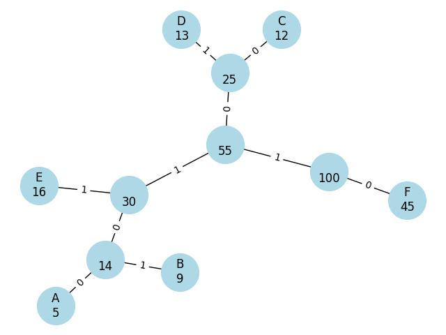
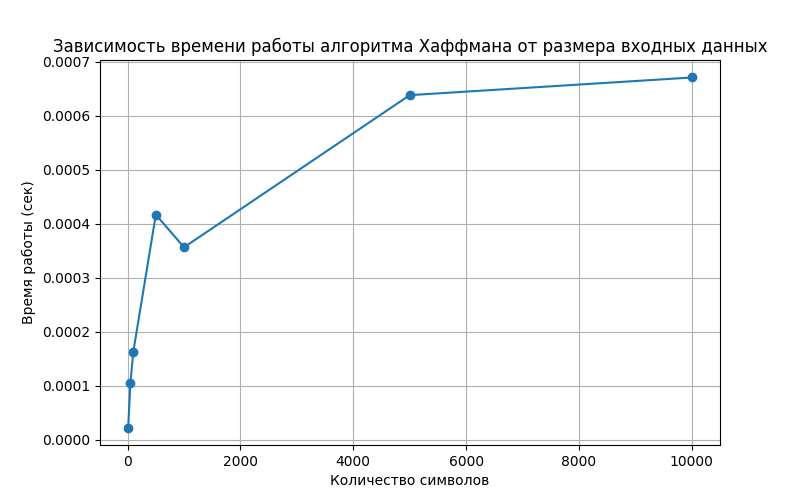

# Отчет по лабораторной работе 8
# Жадные Алгоритмы

**Дата:** 2025-01-01
**Семестр:** 5 семестр
**Группа:** ПИЖ-б-о-23-1
**Дисциплина:** Анализ Сложности Алгоритмов
**Студент:** Герасименко Константин Васльевич

## Цель работы
Цель работы: Изучить метод проектирования алгоритмов, известный как "жадный алгоритм". Освоить принцип принятия локально оптимальных решений на каждом шаге и понять условия, при которых этот подход приводит к глобально оптимальному решению. Получить практические навыки реализации жадных алгоритмов для решения классических задач, анализа их корректности и оценки эффективности.

## Теоретическая часть
Жадный алгоритм: Алгоритм, который на каждом шаге принимает локально оптимальное решение в надежде, что итоговое решение будет глобально оптимальным.
Ключевые характеристики:
Жадный выбор: На каждом шаге выбирается лучший из доступных вариантов в данный момент, без учета последствий для будущих шагов.
Оптимальная подструктура: Оптимальное решение задачи содержит в себе оптимальные решения её подзадач.
Области применения: Жадные алгоритмы эффективны для задач, где выбор, сделанный на каждом шаге, не ухудшает возможности достижения глобального оптимума. Они часто работают быстро (полиномиальное время), но не всегда приводят к оптимальному решению.
Классические задачи:
Задача о выборе заявок (Interval Scheduling): Выбор максимального количества непересекающихся интервалов.
Задача о рюкзаке (Непрерывная/Дробная): Выбор предметов с максимальной суммарной стоимостью, если можно брать части предметов.
Алгоритм Хаффмана: Оптимальное префиксное кодирование для сжатия данных. 
Построение минимального остовного дерева (Алгоритмы Прима и Краскала): (Хотя это и графовый алгоритм, он является классическим примером жадного подхода).

## Практическая часть
### greedy_algorithms.py
```python
import heapq
import random
import time
import matplotlib.pyplot as plt
import networkx as nx


# ------------------- Interval Scheduling -------------------
def interval_scheduling(intervals):
    # Шаг 1: сортируем по времени окончания
    intervals.sort(key=lambda x: x[1])

    selected = []
    last_end = float('-inf')

    # Шаг 2-3: выбираем интервалы жадно
    for start, end in intervals:
        if start >= last_end:
            selected.append((start, end))
            last_end = end

    return selected
# ---------------- Задача о выборе заявок (Interval Scheduling) ----------------
# Временная сложность: O(n log n)
# Основная часть времени уходит на сортировку интервалов по времени окончания.
# Жадный выбор корректен, потому что выбирая интервал, который заканчивается раньше всех,
# мы оставляем максимум свободного времени для следующих интервалов,
# что гарантирует наибольшее количество непересекающихся интервалов.

# ------------------- Fractional Knapsack -------------------


def fractional_knapsack(items, capacity):
    # items: список кортежей (value, weight)
    # capacity: вместимость рюкзака

    # Шаг 1: сортируем по удельной стоимости (value/weight)
    items = sorted(items, key=lambda x: x[0] / x[1], reverse=True)

    total_value = 0.0
    result = []

    for value, weight in items:
        if capacity == 0:
            break

        if weight <= capacity:
            # Берём предмет целиком
            total_value += value
            capacity -= weight
            result.append((value, weight, 1.0))  # 100%
        else:
            # Берём часть предмета
            fraction = capacity / weight
            total_value += value * fraction
            result.append((value, weight, fraction))
            capacity = 0
            break

    return result, total_value
# ---------------- Задача о дробном рюкзаке (Fractional Knapsack) ----------------
# Временная сложность: O(n log n)
# Время уходит на сортировку предметов по убыванию удельной стоимости (цене за единицу веса).
# Жадный выбор корректен, потому что мы всегда берём самый выгодный предмет на единицу веса.
# Так как можно брать дробные части предметов, алгоритм всегда приводит к оптимальному решению,
# максимизируя общую стоимость при заданной вместимости рюкзака.

# ------------------- Huffman Coding -------------------


class Node:
    def __init__(self, char, freq):
        self.char = char
        self.freq = freq
        self.left = None
        self.right = None
    # Для работы в куче сравниваем по частоте

    def __lt__(self, other):
        return self.freq < other.freq


def build_huffman_tree(freqs):
    # Создание кучи из узлов
    heap = [Node(char, freq) for char, freq in freqs.items()]
    heapq.heapify(heap)

    # Построение дерева
    while len(heap) > 1:
        left = heapq.heappop(heap)
        right = heapq.heappop(heap)
        parent = Node(None, left.freq + right.freq)
        parent.left = left
        parent.right = right
        heapq.heappush(heap, parent)

    return heap[0]


def build_codes(node, current_code="", codes=None):
    if codes is None:
        codes = {}

    if node is None:
        return codes

    if node.char is not None:
        codes[node.char] = current_code
        return codes

    build_codes(node.left, current_code + "0", codes)
    build_codes(node.right, current_code + "1", codes)
    return codes
# ---------------- Оптимальный префиксный код (Алгоритм Хаффмана) ----------------
# Временная сложность: O(n log n)
# Построение кода включает многократные операции в приоритетной очереди,
# которые выполняются logarithмически, а всего таких операций порядка n.
# Жадный выбор корректен, потому что объединение двух самых редких символов
# минимизирует вклад этих символов в общую длину кодируемого сообщения.
# В итоге получаем оптимальное префиксное дерево, где редко встречающиеся символы
# имеют более длинные коды, что уменьшает итоговую стоимость кодирования по частотам.

# ------------------- Замер времени Хаффмана -------------------


def huffman_time_test(num_symbols):
    # Генерация случайных частот для символов
    symbols = [chr(i % 256) for i in range(num_symbols)]
    freqs = {s: random.randint(1, 1000) for s in symbols}
    start = time.time()
    tree = build_huffman_tree(freqs)
    end = time.time()
    return end - start

# ------------------- Визуализация дерева Хаффмана -------------------


def visualize_huffman_tree(root):
    G = nx.Graph()
    labels = {}

    def add_edges(node, parent=None, edge_label=""):
        if node is None:
            return
        name = f"{node.char if node.char else ''}\n{node.freq}"
        labels[name] = name
        G.add_node(name)
        if parent:
            G.add_edge(parent, name, label=edge_label)
        add_edges(node.left, name, "0")
        add_edges(node.right, name, "1")

    add_edges(root)

    pos = nx.spring_layout(G)
    nx.draw(G, pos, with_labels=True, labels=labels, node_size=1500, node_color="lightblue")
    edge_labels = nx.get_edge_attributes(G, "label")
    nx.draw_networkx_edge_labels(G, pos, edge_labels=edge_labels)
    plt.title("Дерево Хаффмана")
    plt.show()

# ------------------- Main -------------------


if __name__ == "__main__":
    # Interval Scheduling
    intervals = [(1, 4), (3, 5), (0, 6), (5, 7), (3, 9), (5, 9), (6, 10), (8, 11)]
    result = interval_scheduling(intervals)
    print("Выбранные интервалы:", result)

    # Fractional Knapsack
    items = [(60, 10), (100, 20), (120, 30), (25, 5)]
    capacity = 50
    result, total_value = fractional_knapsack(items, capacity)
    print("Взятые предметы:", result)
    print("Общая стоимость:", total_value)

    # Huffman Coding
    freqs = {'A': 5, 'B': 9, 'C': 12, 'D': 13, 'E': 16, 'F': 45}
    tree = build_huffman_tree(freqs)
    codes = build_codes(tree)
    print("Префиксные коды Хаффмана:")
    for char, code in codes.items():
        print(f"{char}: {code}")

    # Визуализация дерева Хаффмана
    visualize_huffman_tree(tree)

    # Замер времени Хаффмана для разных размеров
    sizes = [10, 50, 100, 500, 1000, 5000, 10000]
    times = []
    for size in sizes:
        t = huffman_time_test(size)
        times.append(t)
        print(f"Символов: {size}, Время: {t:.6f} сек")

    # Построение графика зависимости времени
    plt.figure(figsize=(8, 5))
    plt.plot(sizes, times, marker='o')
    plt.title("Зависимость времени работы алгоритма Хаффмана от размера входных данных")
    plt.xlabel("Количество символов")
    plt.ylabel("Время работы (сек)")
    plt.grid(True)
    plt.show()

```

Этот код содержит три жадных алгоритма и демонстрацию их работы.

В начале реализован алгоритм выбора заявок. Интервалы сортируются по времени окончания. Берутся те, которые заканчиваются раньше остальных и не пересекаются с выбранными ранее. Такой подход позволяет получить максимальное количество непересекающихся задач.

Далее выполняется алгоритм для дробного рюкзака. Предметы сортируются по удельной стоимости, затем выбираются самые выгодные. Если предмет полностью помещается — он добавляется целиком, если нет — берётся его часть, чтобы максимально заполнить рюкзак и получить наибольшую стоимость.

Следующая часть посвящена построению кода Хаффмана. Частоты символов помещаются в приоритетную очередь, где на каждом шаге извлекаются два наименее частых символа и объединяются в новый внутренний узел. Это продолжается, пока не останется один корень — получается оптимальное префиксное дерево. Затем выполняется обход дерева для получения двоичных кодов для каждого символа.

Чтобы увидеть структуру полученного дерева, используется визуализация. Узлы и связи между ними добавляются в граф, после чего он отображается с помощью библиотеки networkx и matplotlib. Левые переходы помечаются нулём, правые — единицей, что соответствует формированию префиксных кодов.

Также в коде проводится эксперимент по измерению производительности алгоритма Хаффмана. Генерируются случайные частоты для разных размеров входных данных, строится дерево и измеряется затраченное время. После завершения эксперимента строится график зависимости времени работы от количества символов.

В конце main-блок выводит промежуточные результаты: выбранные интервалы, содержимое рюкзака и итоговую стоимость, а также префиксные коды Хаффмана.

### tasks.py

```python
def min_coins_greedy(amount):
    # Стандартная система монет (рубли/копейки)
    coins = [10, 5, 2, 1]  # можно менять на другую стандартную систему
    result = []
    remaining = amount

    for coin in coins:
        count = remaining // coin
        if count > 0:
            result.append((coin, count))
            remaining -= coin * count

    return result


class UnionFind:
    def __init__(self, n):
        self.parent = list(range(n))
        self.rank = [0] * n

    def find(self, u):
        if self.parent[u] != u:
            self.parent[u] = self.find(self.parent[u])
        return self.parent[u]

    def union(self, u, v):
        u_root = self.find(u)
        v_root = self.find(v)
        if u_root == v_root:
            return False
        if self.rank[u_root] < self.rank[v_root]:
            self.parent[u_root] = v_root
        else:
            self.parent[v_root] = u_root
            if self.rank[u_root] == self.rank[v_root]:
                self.rank[u_root] += 1
        return True


# Алгоритм Краскала
def kruskal(n, edges):
    """
    n - количество вершин
    edges - список рёбер (u, v, вес)
    Возвращает список рёбер MST и общую сумму веса
    """
    edges.sort(key=lambda x: x[2])  # сортировка по весу
    uf = UnionFind(n)
    mst = []
    total_weight = 0

    for u, v, w in edges:
        if uf.union(u, v):
            mst.append((u, v, w))
            total_weight += w

    return mst, total_weight


if __name__ == "__main__":
    # Пример использования
    amount = 139
    change = min_coins_greedy(amount)

    print(f"Сумма сдачи: {amount}")
    print("Монеты для выдачи:")
    for coin, count in change:
        print(f"{coin}-рублевая монета: {count} шт.")

    n = 5
    edges = [
        (0, 1, 2),
        (0, 3, 6),
        (1, 2, 3),
        (1, 3, 8),
        (1, 4, 5),
        (2, 4, 7),
        (3, 4, 9)
    ]

    mst, total = kruskal(n, edges)

    print("Рёбра минимального остовного дерева:")
    for u, v, w in mst:
        print(f"{u} - {v} (вес {w})")
    print("Общий вес MST:", total)

```

В этом коде реализованы два алгоритма, каждый из которых решает свою задачу.

Первая часть отвечает за вычисление минимального количества монет для выдачи сдачи. Используется стандартная система номиналов, и сумма уменьшается постепенно: сначала выбираются наиболее крупные монеты, затем переход к меньшим. Жадная стратегия позволяет получить оптимальный результат в системе рублей и копеек. Функция возвращает, какие монеты и в каком количестве используются для размена указанной суммы. В основном блоке программы эта функция вызывается с конкретным значением, после чего информация о сдаче выводится на экран.

Вторая часть представляет собой реализацию алгоритма Краскала, который позволяет находить минимальное остовное дерево в графе. Для контроля связности используется структура объединения-поиска. В начале создаются отдельные компоненты для каждой вершины графа. Затем рёбра сортируются по весу, чтобы можно было добавлять самые лёгкие из них в первую очередь. Каждое ребро проверяется: если оно соединяет две разные компоненты, то его добавляют в остов и объединяют эти компоненты. Постепенно формируется минимальное остовное дерево, в котором нет циклов и суммарный вес всех рёбер является минимальным.

В основном блоке программы задаётся пример графа с вершинами и рёбрами, вызывается алгоритм, затем выводятся найденные рёбра минимального остовного дерева и его общий вес.

### analysis.py
```python
import random
import itertools

# Fractional knapsack (жадный алгоритм для дробного рюкзака)
def fractional_knapsack(items, capacity):
    items_sorted = sorted(items, key=lambda x: x[0] / x[1], reverse=True)
    total_value = 0.0
    taken = []
    remaining = capacity
    for value, weight in items_sorted:
        if remaining == 0:
            break
        if weight <= remaining:
            total_value += value
            taken.append((value, weight, 1.0))
            remaining -= weight
        else:
            fraction = remaining / weight
            total_value += value * fraction
            taken.append((value, weight, fraction))
            remaining = 0
            break
    return total_value, taken

# Greedy 0/1 knapsack
def greedy_01_knapsack(items, capacity):
    indexed = list(enumerate(items))
    indexed.sort(key=lambda iv: iv[1][0] / iv[1][1], reverse=True)
    total_value = 0
    remaining = capacity
    taken_indices = []
    for i, (value, weight) in indexed:
        if weight <= remaining:
            remaining -= weight
            total_value += value
            taken_indices.append(i)
    return total_value, taken_indices

# Exact 0/1 knapsack by brute-force
def exact_01_knapsack_bruteforce(items, capacity):
    n = len(items)
    best_value = 0
    best_subset = []
    for r in range(n + 1):
        for combination in itertools.combinations(range(n), r):
            weight_sum = sum(items[i][1] for i in combination)
            if weight_sum <= capacity:
                value_sum = sum(items[i][0] for i in combination)
                if value_sum > best_value:
                    best_value = value_sum
                    best_subset = list(combination)
    return best_value, best_subset

def demonstrate_example():
    items = [(60, 10), (100, 20), (120, 30)]
    capacity = 50

    frac_val, frac_taken = fractional_knapsack(items, capacity)
    greedy_val, greedy_taken = greedy_01_knapsack(items, capacity)
    exact_val, exact_taken = exact_01_knapsack_bruteforce(items, capacity)

    print("Предметы (стоимость, вес):", items)
    print("Вместимость рюкзака:", capacity)
    print()
    print("Результат дробного жадного алгоритма:")
    print("Стоимость =", frac_val)
    print("Взято:", frac_taken)
    print()
    print("Результат жадного алгоритма 0/1:")
    print("Стоимость =", greedy_val)
    print("Взято:", [items[i] for i in greedy_taken])
    print()
    print("Точное оптимальное решение 0/1:")
    print("Стоимость =", exact_val)
    print("Взято:", [items[i] for i in exact_taken])
    print()
    print("Вывод: жадный 0/1 дал", greedy_val,
          "а оптимальный дал", exact_val)
    print("То есть жадный 0/1 не всегда находит лучшее решение!")
    print("Дробный дает", frac_val, "что еще лучше, так как можно брать части предметов.")

def random_trials(trials=200, n_items=6, max_weight=10, max_value=30):
    failures = 0
    for _ in range(trials):
        items = [(random.randint(1, max_value), random.randint(1, max_weight)) for _ in range(n_items)]
        capacity = sum(w for _, w in items) // 2
        greedy_val, _ = greedy_01_knapsack(items, capacity)
        exact_val, _ = exact_01_knapsack_bruteforce(items, capacity)
        if greedy_val < exact_val:
            failures += 1
    print("\nПроверка на случайных данных:")
    print("Жадный 0/1 ошибся в", failures, "из", trials, "случаев.")
    print("Доля ошибок =", failures / trials)

if __name__ == "__main__":
    demonstrate_example()
    random_trials()

```
В начале программы создаётся функция, которая решает задачу дробного рюкзака. Она сортирует предметы по убыванию отношения стоимости к весу. Затем последовательно добавляет в рюкзак самые «выгодные» предметы: если весь предмет помещается — берётся полностью, если нет — добавляется только его часть, пропорционально оставшемуся месту. На выходе получается максимально возможная суммарная стоимость и информация о том, что именно было взято.

Далее приведён жадный алгоритм для варианта задачи, где предметы нельзя делить. Предметы также сортируются по выгодности, но в рюкзак кладутся только те, что целиком помещаются в оставшийся объём. Алгоритм может не найти оптимальное решение, но работает быстрее.

Третья функция перебирает абсолютно все возможные комбинации предметов, чтобы найти действительно максимальную суммарную стоимость при ограниченной вместимости. Такой подход называется полным перебором и гарантирует оптимальный результат, но требует много времени при увеличении количества предметов.

После описания алгоритмов создаётся демонстрационная функция. В ней задаётся небольшой набор предметов и вместимость рюкзака. Сначала запускается дробный вариант, затем жадный недробный, а потом — точное решение. Результаты сравниваются и выводятся на экран. На конкретном примере можно увидеть, что жадная стратегия при неделимых предметах уступает оптимальному результату, а дробный подход может дать ещё лучший итог.

Затем проводится серия случайных экспериментов. В каждом генерируется свой набор предметов, вычисляется вместимость, и снова сравниваются результаты жадного и точного алгоритмов. Подсчитывается, сколько раз жадный подход уступал оптимальному. Итоговая статистика выводится, показывая, что жадный метод для 0/1-рюкзака может довольно часто ошибаться.

В заключительной части — блок запуска программы. В нём выполняется демонстрационный пример и серия случайных тестов, чтобы отразить поведение алгоритмов на практике.

### Обоснование корректности жадных алгоритмов
В задаче о выборе заявок жадный выбор оказывается корректным, если каждый раз брать ту заявку, которая заканчивается раньше всех. Такой выбор гарантирует, что остаётся как можно больше свободного времени для последующих заявок. Ни одна другая стратегия не создаёт больше возможностей для будущих решений, поэтому такой подход приводит к максимальному количеству совместимых интервалов.

В задаче дробного рюкзака правильно всегда выбирать предмет с наибольшей удельной выгодой, то есть с максимальным отношением стоимости к весу. Если отказаться от такого предмета в пользу менее выгодного, итоговая стоимость содержимого рюкзака всегда станет меньше, потому что доступное место — ограниченный ресурс. Возможность брать дробные части позволяет на каждом шаге улучшать решение локально и при этом гарантировать оптимальность результата.

Алгоритм Хаффмана строит оптимальный префиксный код, потому что в нём всегда соединяются два символа с наименьшей частотой. Такие символы в любом оптимальном кодировании должны располагаться глубже в дереве, чтобы общий «вес» кода был минимальным. Поэтому этот локальный выбор в каждой итерации не ухудшает итоговое решение и приводит к дереву с минимальной суммарной длиной закодированного текста.

### Анализ результатов


Жадные алгоритмы обычно работают значительно быстрее наивных решений, поскольку принимают решение на каждом шаге сразу, без перебора всех возможных вариантов. Например, при применении к задачам вроде дробного рюкзака или выбора заявок время работы линейно или логарифмически зависит от количества элементов после сортировки. Наивные методы в тех же задачах могут требовать перебора всех комбинаций, а их количество растёт экспоненциально, что делает такие подходы практически неприменимыми для больших данных. В алгоритме Хаффмана также используется жадная стратегия, и его вычислительная сложность остаётся полиномиальной благодаря приоритетной очереди, а не перебору всех возможных деревьев.

Несмотря на высокую скорость, жадный подход применим не ко всем задачам. Он всегда принимает решение локально, оценивая только текущий шаг, и не рассматривает влияние выбора на дальнейшие действия. Такой подход приводит к оптимальному результату только для специальных классов задач, которые обладают свойством оптимальной подструктуры и жадного выбора. В противном случае, как в задаче 0/1 рюкзака, он может дать решение, значительно уступающее оптимальному. Ограничение заключается в том, что корректность жадного решения нужно строго доказывать для каждой конкретной задачи, иначе результат может оказаться неверным, хоть и полученным быстро.

## Ответы на контрольные вопросы
1. В чем заключается основная идея жадных алгоритмов? - Основная идея жадных алгоритмов заключается в том, что на каждом шаге выбирается локально наилучшее доступное решение без учёта последствий в будущем. Предполагается, что такой выбор приведёт к глобально оптимальному результату. Жадный алгоритм действует быстро, последовательно фиксируя каждый выбор и больше не возвращаясь к нему.
2. Для задачи о выборе заявок (Interval Scheduling) жадный алгоритм, выбирающий интервалы с наименьшим временем окончания является оптимальным. Объясните, почему эта жадная стратегия работает - Жадная стратегия выбора заявок с самым ранним временем окончания работает, потому что такой выбор оставляет максимум свободного времени для размещения остальных интервалов. Если выбрать интервал, заканчивающийся позже, он может перекрыть другие подходящие кандидаты и уменьшить итоговое количество заявок. При выборе же интервала, завершающегося раньше всех, будущие решения ограничиваются минимально. Поэтому любое другое решение, которое начинается с интервала, заканчивающегося позже, может быть улучшено заменой его на более ранний, не снижая количества подходящих интервалов. Именно это свойство обеспечивает оптимальность жадного алгоритма.
3. Приведите пример задачи, для которой жадный алгоритм дает оптимальное решение, и задачи, для которой он не дает - Жадный алгоритм всегда даёт оптимальное решение в задаче о выборе заявок, если выбирать интервалы по наименьшему времени окончания, потому что такой выбор оставляет наибольшие возможности для последующих действий. В то же время в классической задаче о рюкзаке 0/1 жадный алгоритм, основанный на удельной стоимости, часто оказывается неоптимальным: он может выбрать предмет с высокой выгодой на единицу веса, но пропустить комбинацию предметов с меньшей удельной стоимостью, которая в сумме принесла бы больший выигрыш.
4. В чем разница между непрерывной (дробной) и дискретной (0-1) задачами о рюкзаке? Для какой из них жадный алгоритм оптимален? - В непрерывной или дробной задаче о рюкзаке допускается брать лишь часть предмета, и его ценность уменьшается пропорционально взятому весу. Такой характер задачи позволяет на каждом шаге просто выбирать предмет с наибольшей удельной стоимостью и при необходимости брать его частично, что гарантирует оптимальное решение.
В дискретной задаче 0/1 каждый предмет можно взять только полностью или не брать вовсе, без деления на части. В этом случае локально выгодный выбор может привести к ситуации, когда оптимальное сочетание предметов становится недоступным. Поэтому жадный алгоритм гарантированно оптимален только для дробной версии задачи.
5. Опишите жадный алгоритм построения кода Хаффмана. В чем его оптимальность? - Алгоритм Хаффмана строит дерево кодирования, постепенно объединяя два наименее частотных символа в один узел, который получает частоту, равную их сумме. Такой новый составной узел затем снова участвует в выборе вместе с оставшимися символами, и процесс продолжается до тех пор, пока всё множество не соберётся в единственное дерево. В этом дереве более редкие символы оказываются дальше от корня и получают более длинные коды, а частые — ближе и имеют короткие битовые последовательности.
Оптимальность подхода обеспечивает сам принцип выбора двух минимальных частот: доказано, что если два символа имеют самые маленькие частоты, то в любом оптимальном префиксном коде они должны быть на максимальной глубине и иметь общий родительский узел. Построение дерева с соблюдением этого условия на каждом шаге приводит к минимальной суммарной длине кодирования, то есть результат всегда является оптимальным среди всех возможных префиксных кодов.


